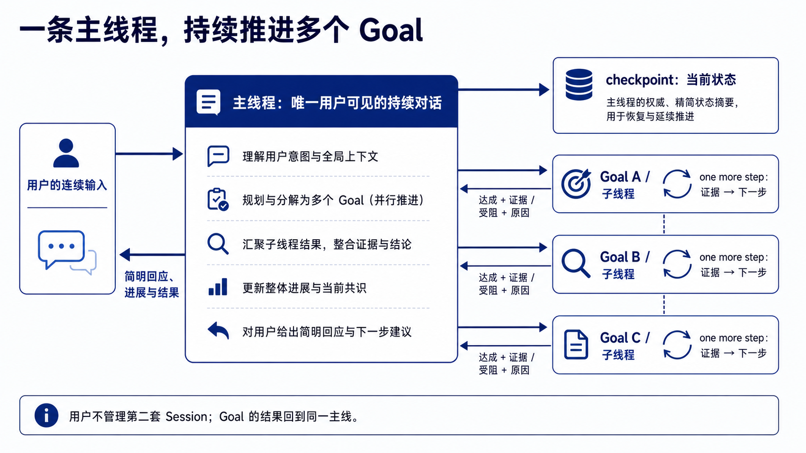
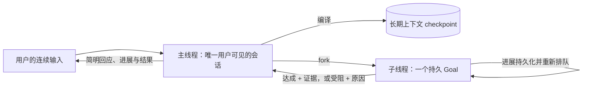
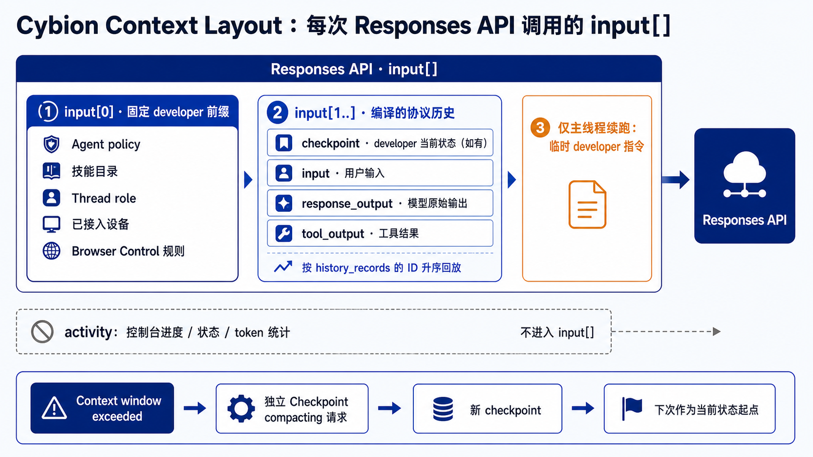
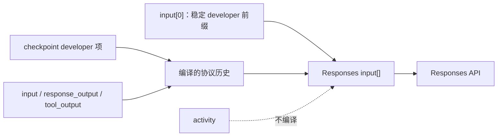
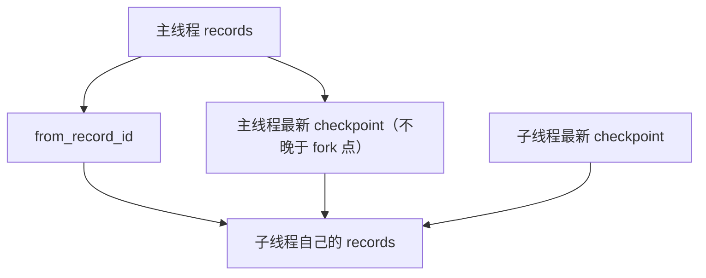
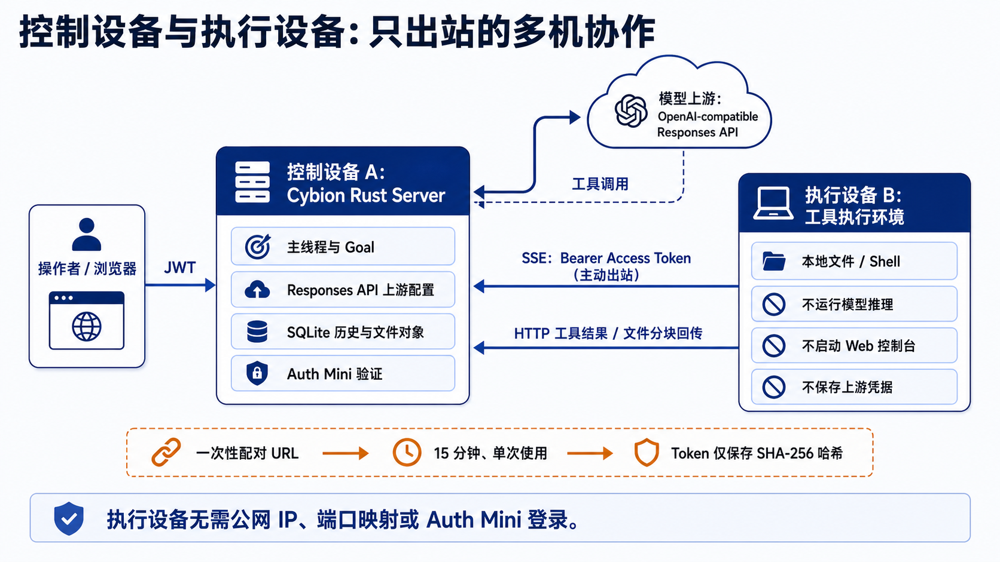
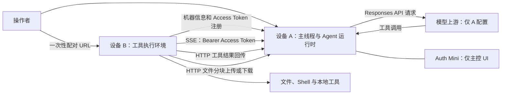
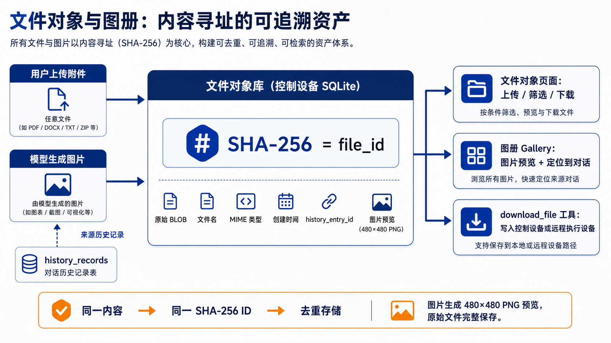
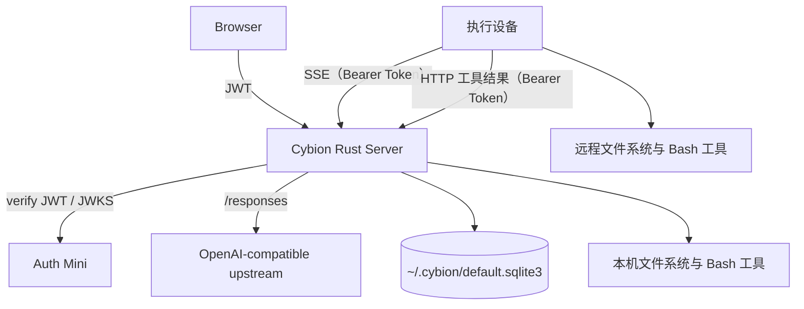

# Cybion

**Cybion 是面向多台设备、可长期使用的 AI Harness**。它以用户可见的一条持续对话
作为主线，将工具和可接入的机器组织为连续的操作界面，而不要求人管理项目和会话。

- [Cybion 产品介绍](docs/introduction.md)：了解产品定位、核心能力、适用场景与安全边界。
- [架构设计小巧思](docs/design-tricks/README.md)：按主题说明 Cybion 的分离式执行、持久上下文、安全更新与线程设计。

Cybion 适合已经拥有本机、家用主机、云服务器等多种设备，并希望让 AI 在这些真实
机器上持续协作的个人操作员。它是实验性、高信任度的软件；授权后的 Agent 可以使用
文件系统和 Shell，因此只应部署在你愿意授予该权限的机器上。

> 当前版本已提供持久化主线程、可回收子线程、上下文 checkpoint 与稳定前缀编译、
> Web GUI、Auth Mini 身份验证、OpenAI-compatible Responses API 上游、本机与远程文件
> 和 Shell 工具、控制/执行设备角色，以及浏览器中的连续语音输入和主动
> 播报。控制设备还可启动严格隔离的 Browser Control 会话；启用 Computer Use 时，模型的
> 视觉操作在高影响动作前必须由操作者批准。AI 音箱、车载智能等专用交互设备仍是产品方向。

## 为什么还要做一个 Harness？

Claude Code、ChatGPT（Codex）、Pi、OpenCode、OpenClaw、Hermes 等产品已经证明了
Agent Harness 的价值。Cybion 的出发点不是再复制一个终端代理，而是围绕三个核心对象
组织产品：**对话系统、用户入口和设备**。对话系统承载用户持续推进的思考，入口让用户
能在合适的时刻介入，设备则是 Agent 实际可以操作的世界。

### 1. 单一会话：围绕人的思考带宽设计

人类用户的思考带宽有限：同一时间只能稳定地持有少量目标、判断和上下文。Harness
应当适应这一限制，把用户的意图、过程和结果留在一条连续的对话中，而不是要求用户为
机器的会话、项目和目录模型不断创建、切换与拼接上下文。

许多 Harness 将项目目录和会话作为用户需要显式创建、打开、切换和归档的对象。使用
一段时间后，用户往往会积累大量已结束但又不敢确定可以删除的会话。所谓“归档”通常
发生在新会话自然覆盖旧会话之后，而不是一次明确、可靠的人类决策。

项目也是类似的问题。现代软件工作常由许多短生命周期的小任务组成；先创建目录，再
显式用 Harness 打开它，既增加了操作，也把对话人为地限制在目录边界内。跨项目沟通
因此变得别扭。对话不应成为用户需要管理的对象；系统应当围绕用户持续推进的思考来
组织信息。

Cybion 将用户界面收敛为**单一会话**：所有沟通都在这里发生，记录会持久化。它不只是
“持续对话”，而是以人能够连续思考和判断为中心的交互边界。系统负责维护这条主线和
上下文，用户不需要判断何时结束一段 Session，也不需要自行恢复跨会话的背景。

### 2. one more step：用真实反馈驱动迭代

真实工作往往无法在开始时被完整理解。用户的目标会随着新信息而改变，Agent 也只有在
读取文件、运行工具、观察环境和拿到中间结果之后，才知道接下来最有价值的动作是什么。
把尚未发生的过程过早固化，只会让系统花费精力维护猜测，而不是解决眼前的问题。

Cybion 的迭代哲学是 **one more step**：依据当前对话、已有产物、工具反馈和可验证证据，
选择并完成下一个有用步骤；结果返回后，把新事实合并回主线程，再重新判断下一步。每一步
都应推动真实结果向前，同时保留用户随时介入、改变方向或停止的空间。长期工作因此来自
连续而可追溯的迭代，而不是要求 AI 在一开始就知道完整路径。

这不意味着主线程可以把用户完整目的地预先缩小为一个更容易完成的阶段。主线程只规范化
并保留完整 **Big Goal**；复杂目标可以作为一个完整 Goal fork 给子线程。执行线程再依据
当前真实状态与完整目的地之间的差距，以 one more step 持续推进。安全骨架、研究结果或
首个阶段只是进展，不能被报告为完整目标已经完成。

Cybion 永远不做长期规划器，也不引入规划器相关建模，例如 requirement graph、coverage
database、自动阶段拆分或里程碑编排。系统只持有明确目的地，并根据新证据继续走下一步。

### 3. 主线程与 Goal：一个面向人的入口，持续推进的执行循环

**主线程 (Main Thread)** 是与用户直接对话的 AI 会话线程，也是单一会话在系统中的
实现形式。用户始终只面对主线程；它维护长期对话的主线，并负责把完整历史编译为当前
推理所需的上下文。

每个持久 **Goal** 都由一个**子线程 (Subthread)** 执行。它的 `title` 是简短名称，`task`
是持久目标，并且必须在创建时声明可验证的完成条件。用户可以直接在 Goals 页面创建、
查看、编辑和删除 Goal；从主线程 fork 时，系统将 fork 点记为 `from_record_id`，子线程据此
回放该点及之前所需的主线程记录。直接创建的 Goal 也会留下明确的主线程 fork 点，并以目标和
完成条件作为子线程的首条输入。用户始终只向主线程输入，不形成第二套 Session。

Goal 不以一次自然语言回复为完成。每一轮执行后，系统把回复作为进展持久化并将同一个
子线程重新排队；它一直循环，直到子线程明确调用 `achieve_goal` 并提供证据，或调用
`block_goal` 并说明继续推进所需的外部变化。取消会将 Goal 标为 `cancelled`。终态 Goal
保留目标、完成条件、状态、证据或受阻原因、最终结果和事件历史，随后主线程收到一次
终态交接并继续推进用户的整体结果。

主线程采用 **MIMO (多入多出式交互)**：它应快速接收用户连续不断的输入，先给出
简明扼要的回应，而一次输入可以得到多次输出，例如即时确认、任务进展、完成结果或
需要用户判断的提示。这样，后台 Goal 仍在推进时，用户无需等待它结束才能继续思考和
下达下一条指令。

主线程和所有子线程都在控制设备本机运行并发起模型推理。线程本身不绑定设备；本机或
远程设备的选择只属于一次具体的文件系统或 Bash 工具调用，因此同一个线程可以在连续的
工具调用中操作不同设备。





### 4. 协议历史与上下文编译

**`history_records` 是唯一的对话与运行历史表。** 每一条记录保存一个可回放的协议项，
上下文由这些记录按确定的线程边界和 checkpoint 规则编译；控制台进展也写入同一张表，
但不会进入模型输入。

```sql
history_records (
  id         INTEGER PRIMARY KEY AUTOINCREMENT,
  thread_id  TEXT NULL,  -- NULL 为主线程；子线程使用自己的 ID
  kind       TEXT NOT NULL,
  payload    TEXT NOT NULL, -- JSON 协议项
  created_at TEXT NOT NULL
)
```

常规运行中，记录按全局 `id` 追加且不可更新或删除；只有用户明确清空对话时，系统才会在
受控的重置事务中删除历史。`kind` 决定 `payload` 的用途：

| `kind` | `payload` | 是否编译到模型输入 |
| --- | --- | --- |
| `input` | 用户输入或系统生成的 Goal 输入项 | 是 |
| `response_output` | 上游 Responses `output[]` 中的一个原始输出项，例如 `message`、`function_call` 或 `computer_call` | 是 |
| `tool_output` | 工具输出项，例如 `function_call_output` 或 `computer_call_output` | 是 |
| `checkpoint` | 以 `developer` 角色保存的当前状态 | 是 |

完整工具输出以协议项持久化；为满足单次模型上下文的长度限制，编译 `function_call_output`
时会沿用输出长度上限，保存的原始 `payload` 不会被截断。`response_output` 与
`tool_output` 在下一轮作为 Responses `input` 的协议项回放，而不是转换成文本执行轨迹。

#### Context Layout

**Context Layout 是每次调用 Responses API 时 `input[]` 的确切组成和顺序。** 所有 Agent
指令都放在 `developer` 协议项中；请求不设置顶层 `instructions` 字段。这样，稳定指令、
压缩后的当前状态和持续变化的协议历史都有明确的角色与位置。



常规 Agent 请求的 `input[]` 从一个稳定的 Markdown `developer` 前缀开始：

| 顺序 | 协议项 | 内容 |
| --- | --- | --- |
| `input[0]` | `developer` | `# Cybion agent policy`：one-more-step 工作方式和当前安装的技能目录；`## Thread role`：主线程或子线程的职责与终态规则；有已接入设备时附加远程执行设备清单；可用 Browser Control 时附加浏览器控制规则。 |
| `input[1..]` | 编译出的协议项 | checkpoint 的 `developer` 项，以及按记录顺序排列的 `input`、`response_output` 和 `tool_output`；真实 user input 与 `function_call_output` 后紧随不持久化的 UTC developer 时间锚点。 |
| 最后一项（仅子线程刚结束而触发主线程续跑时） | `developer` | 要求主线程基于该子线程的证据继续推进原始用户结果的临时续跑指令。 |

固定前缀在每一次 Responses 调用前都会重新放在 `input[0]`。模型产生的
`response_output` 原始项会立即追加到本次运行中的协议序列；若其中包含
`function_call` 或 `computer_call`，对应的 `function_call_output` 或
`computer_call_output` 随后追加，形成下一次 Responses 调用的后缀。所有这些项也会写入
`history_records`，供下一次上下文编译使用。用户刚提交的输入在运行开始前已作为 `input`
记录写入，因此保留其原始 `user` 协议角色，而不会被包装成“历史证据”文本。编译器会在真实用户输入与 `function_call_output` 后追加稳定的 UTC 时间锚点；锚点不持久化，且不改变原始 Responses 协议项。

主线程的常规布局如下，其中 `C` 为当前可见范围内最新 checkpoint，`M` 为本次编译的 `idx_tail`：

```text
无 checkpoint：
[ 固定 developer 前缀 ] [ 主线程 records #1 .. #M ]

有 checkpoint：
[ 固定 developer 前缀 ] [ checkpoint #C（developer） ]
[ 主线程 records #C+1 .. #M ]
```

子线程使用同一个稳定前缀，但协议历史按 fork 边界编译：若子线程已有 checkpoint，则后缀是
该 checkpoint（包含）到该子线程自身 `idx_tail` 的记录；否则后缀先是主线程的最新 checkpoint（若有）
到 `from_record_id`（包含）的主线程记录，再是该子线程从起点到自身 `idx_tail` 的记录。兄弟子线程的
记录永远不进入该后缀。

`response_output` 和 `tool_output` 保持 Responses 协议项回放，而不是转换成文本执行轨迹。
`function_call_output` 的完整内容保存在 `history_records`；为控制单次请求的长度，只有编译到
模型输入时才会按工具输出上限截短。运行状态通过实时 SSE 传递，不写入 `history_records`。时间锚点由不可变记录的 `id` 与 `created_at` 在编译时派生，不写回历史。详见[Time Awareness](docs/time_awareness.md)。

发生上下文窗口溢出时，Controller 发起无工具的 checkpoint compacting 请求：它保持稳定 developer 前缀和已编译历史不变，只在历史末尾追加 terminal `developer` compaction instruction。模型 output 先作为不可变 `response_output` 保存，Controller 验证后才把该 exact text promotion 为新的 checkpoint；中间 compaction nodes 永不进入普通 checkpoint 链。



#### 主线程的 `idx_head` 与 `idx_tail`

每次请求从当前主线程最后一条协议记录得到 `idx_tail`。`idx_head` 是不晚于该尾部的最后一个
checkpoint；若不存在 checkpoint，则为不晚于 `idx_tail` 的第一条主线程协议记录。回放区间为
`[idx_head, idx_tail]`，精确过滤主线程的 `input`、`response_output`、`tool_output` 和
`checkpoint`，并按 `id` 升序排列。checkpoint 本身包含在结果中。

上下文窗口溢出时，Cybion 通过 checkpoint compacting 将已编译的上下文压缩为新的不可变
checkpoint 后重试。写入前会在
SQLite 事务中确认主线程最新协议记录仍等于这次编译的 `idx_tail`，避免把发生变化的历史标记为已覆盖。

#### 子线程的 fork 与查询边界

每个子线程在 `subthreads.from_record_id` 保存它从主线程分出的记录 ID。子线程有自己的
`history_records.thread_id`，因此多个子线程可以并发追加全局记录 ID，而不会相互进入对方的
上下文。



子线程的 `idx_head` 按以下顺序确定：

1. 先在该子线程中，取 `id <= max(该子线程 record id)` 的最新 checkpoint。存在时，只回放该
   子线程从该 checkpoint（包含）到自身 `idx_tail` 的记录。
2. 若子线程没有 checkpoint，则在主线程中取 `id <= from_record_id` 的最新 checkpoint；从该
   checkpoint（包含）回放主线程至 `from_record_id`，再回放该子线程自身的全部记录。
3. 若该主线程范围也没有 checkpoint，主线程部分从记录 `1` 开始。

所有查询都以 `thread_id IS NULL` 或精确的子线程 `thread_id` 过滤。全局 `id` 的并发交错只决定
持久化次序；它不能使一个兄弟子线程的记录出现在另一个子线程的上下文中。

#### 历史读取

`search_thread_history` 按关键词或短语查询完整主线程的非 `activity` 记录，并返回
`record_id`、`kind` 和原始 `payload`；`read_thread_history` 按包含两端的记录 ID 区间分页读取
同样的协议 records。`get_checkpoint` 读取一个主线程 checkpoint 的原始 Markdown 当前状态。
它们让 Agent 按需取得较早的历史，而不要求一次请求容纳全部记录。

发生上下文溢出时，checkpoint compacting 的提示词会要求把仍应保留的协作偏好、项目路径、
持久配置和已验证设备或服务状态，作为简短的
`## Long-term facts` Markdown 列表写入 checkpoint，并在每项旁标注相关历史 record ID。这个
列表随 checkpoint 作为 `developer` 协议项进入后续上下文；不再相关的事实不会带入新 checkpoint。
Token、密码、API key、Cookie 或其他密钥不会被保留在该列表中，也不会根据对话推断人格特征。

服务重启时只恢复尚未开始执行的输入；已经开始调用工具的运行会明确标记失败而不会自动
重放，以免重复产生副作用。

### 5. 易用性：从任意入口随时介入

易用性不只是移动端适配，而是让用户在合适的时刻以合适的方式回到同一条主线程：在
桌面上输入和查看执行过程，在手机或平板上随时查看进展、补充目标，或直接用语音表达
意图。语音输入是 Cybion 的一等交互方式，而不是桌面键盘输入的附属功能。


一个典型使用路径是：

1. **纯语音对话**：走路或处理其他事情时，戴上耳机直接与同一条主线程交流；基本的提问、补充、纠正和后续指令不要求查看屏幕。
2. **手机快速查看**：一段对话或任务推进后，打开手机查看简短汇报、进度和需要自己决定的事项，再通过输入或语音继续补充。
3. **桌面深度协作**：坐在电脑前时，查看完整对话、工具过程、文件和证据；在需要时提出更复杂的目标，或对多台已授权设备上的操作作出判断。

移动端必须存在，因为用户的工作和判断不会只发生在电脑前。Web GUI 让手机、平板或
任意浏览器都能回到同一条对话；它不把移动端限定为某个桌面应用的附属能力。Cybion
使用 Rust HTTP Server 承载嵌入式控制台，通过 Auth Mini 处理身份验证，并使用
OpenAI-compatible Responses API 连接模型上游。

这条交互路径也为未来的纯语音交互，以及 AI 音箱、车载智能等更多设备形态奠定基础。
例如，用户戴着耳机、同时处理其他事情时，可以随时追加指令，并在任务完成或需要判断
时听到主动播报。人无法同时有效接收两条独立的音频流，因此指令、进展和播报必须归属
于同一条有序、可持续的主线程；否则语音交互不会减少认知负担。当前浏览器 Web GUI 提供
自动静音分段的连续语音输入和按主线程顺序播放的主动播报；AI 音箱、车载智能等专用
设备形态仍是产品方向。

### 6. 设备是可远程调用的执行环境

个人可控制的计算环境天然是多样的：Mac、Linux、Windows、云服务器和家中的主机各自
拥有文件、进程、网络与工具。Cybion 将它们视为可由远程工具调用的执行环境，而不是
必须各自运行 AI 推理的孤立工作区。

推理集中在控制设备 A：A 上的主线程向配置在 A 上的 Responses API 上游发起请求，并把
远程设备 B 的能力作为可调用工具提供给该次推理。当模型选择该工具时，A 将调用送入 B
主动保持的 SSE 连接；B 执行文件、Shell 或其他本地工具后，以 HTTP 回传结果。结果回到 A，
继续同一条主线程的推理。B 不发起 AI 推理请求，也不需要配置 OpenAI Responses 上游。



`copy_files` 复用这条纯出站通道：源设备将压缩 tar 包以 Bearer HTTP 分块上传到 A，A 校验
总大小、顺序与 SHA-256 后再让目标设备取回分块并安全解包。文件内容不会进入模型上下文或
普通工具结果接口；tar 条目禁止绝对路径、`..`、符号链接及其他非常规类型，目标目录在校验
通过后才原子替换。目标可为另一台执行设备，也可以是仅写入 A 的 `~/.agents/skills` 的受限
`skill-store`。这不会给执行设备引入“拥有技能”的概念：技能目录、启用权和渐进式读取始终
属于控制端。

操作者在 A 的【机器】页创建一次性配对命令。命令中的 Token 只位于 URL fragment，控制端仅
保存其 SHA-256 哈希，15 分钟内只能使用一次。B 运行 `cybion --pair '<pairing-url>'` 时自行生成
Access Token，并携带机器 ID、主机名和 Token 向 A 注册；A 只保存 Access Token 哈希。配对后 B
只持久化控制端 URL、自己的 Access Token 与机器 ID，立刻进入只出站的守护进程：不监听 HTTP、
不启动 Web 控制台、不登录或验证 Auth Mini，也不保存模型上游凭据。



主线程和子线程使用同一组文件系统与 Bash 工具：省略可选的 `target_device` 或将它填为空字符串时，
在控制设备本机执行；填写已接入的设备 ID 时只把这一次工具调用转发到对应设备。Goal 达成或受阻后的
终态结果仍会自动回收到同一条主线程。

### 7. 部署不应限制控制范围

控制家里的机器不应以拥有公网 IP 为前提。每台执行设备只需能够以 HTTPS 访问控制设备；
它不需要端口映射、FRP、Cloudflare Tunnel 或任何可公开访问的地址。这样，用户可以从
控制端的已登录浏览器管理所有设备，而不必先将家用网络改造成公开服务器。

远程控制台仍应经 HTTPS 暴露，并只部署在你愿意授予文件系统和 Shell 权限的机器上。
网络连通解决访问问题；操作者 API 由 Auth Mini JWT 保护，远程工具调用由设备 Token
和共享 `root_user_id` 限制设备间的权限。

### 8. 文件对象与图册：可追溯的内容资产

控制设备保存一个内容寻址的文件对象库。上传的附件和模型生成的图片都以内容的 SHA-256
作为 `file_id`，因此同一内容只保存一份。文件对象保存原始内容、文件名、MIME 类型、创建时间、
可选的来源历史记录 ID，以及图片缩略预览；二进制内容不作为普通工具结果放入模型上下文。



控制台提供【文件对象】页用于上传、筛选和下载资产，并提供【图册】页浏览上传或生成的图片、
查看预览并定位到产生它的对话历史。Agent 可通过 `download_file` 使用文件对象的 `file_id`
把资产写入控制设备或已接入执行设备的精确路径。

## 当前能力

- 一个持久化的对话记录，Agent 的工具调用过程实时流式显示；主线程输入固定在控制设备
  Web GUI 的全局底部区域，用户在任意页面都可以继续向同一条主线程输入。
- Agent 以 **one more step** 推进：根据当前历史、工具反馈和证据完成下一步，再用新结果
  重新判断方向，并允许用户在任意一次结果后介入或改变方向。
- 持久化的 MIMO 主线程：连续输入会立即入库并按顺序执行，一次输入可以依次产生已接收、
  上下文编译、工具进展和完成结果；刷新浏览器不会丢失已接受的输入。
- 溢出驱动的 append-only checkpoint、完整的协议历史与运行 activity、按关键词读取的主线程
  records；checkpoint compacting 会把仍有价值的长期事实直接保留在 checkpoint 中。Agent 可用
  `get_checkpoint`、`search_thread_history` 和 `read_thread_history` 按需读取较早记录。
- 从主线程 fork 的后台子线程即持久 Goal；fork 点以 `from_record_id` 固化；每个 Goal 固化名称、目标、完成条件与模型，并在
  非终态回复后记录进展、继续循环。只有 `achieve_goal` 记录可验证证据或 `block_goal` 记录
  具体受阻原因才能结束循环；取消会形成 `cancelled` 终态。Goals 页面将主线程固定置顶，并保留
  所有 Goal 的状态和模型；可直接新建、编辑或删除 Goal。编辑会清除旧终态并按新目标重新排队，
  删除会永久移除该 Goal 的执行与事件历史。详情页显示目标、完成条件、目标语义状态、证据或
  受阻原因、最终结果与事件历史。只为 active Goal 打开 SSE；终态仍可只读查看。子线程不能接收
  prompt，不形成第二套 Session。内部 HTTP API 继续使用 `/api/threads` 前缀。
- 内嵌中英双语 Web GUI，支持亮/暗主题、语音输入、文件浏览和编辑。
- 浏览器连续语音输入和按主线程顺序播放的主动语音播报。
- **Browser Control 与 Computer Use**：Agent 可自主创建、列出、聚焦与关闭独立的临时 Chromium
  会话；结构化 DOM 操作显式携带 session ID，因此 Agent 能同时操纵所有会话。会话可访问任意
  HTTP(S) 网页；启用原生 Computer Use 后，Agent 先聚焦一个会话，再由 Responses `computer`
  工具驱动其截图、点击、输入和滚动。提交表单、敏感字段、Enter 与 Computer Use 的点击/输入
  会暂停，直到控制台明确批准。会话关闭即销毁 profile；不会接管用户日常浏览器或读取其 cookie、
  扩展和主机环境变量。
- 可配置的文件系统、Bash 与网页搜索工具集；`list_files`、`read_file`、`write_file`、
  `edit_file` 和 `run_bash` 都接受可选的 `target_device`，省略或填空字符串时在控制设备本机执行。
  `copy_files` 通过主控中继复制一个文件或目录：可从控制端或指定执行设备复制到指定执行设备；
  也可复制到受限的 `skill-store`，将源目录原子安装为控制端 `~/.agents/skills/<目录名>`。
  `load_skill` 与 `read_skill_resource` 只允许读取这个主控技能根目录内的已安装技能及相对资源，
  保留 SKILL 的渐进式披露而不要求推理环境拥有通用文件系统权限。
  每次 Bash 调用会在开始时持久化记录命令、目标机器和 `running` 状态，并在【命令】页以可展开的
  列表展示返回结果、退出码、结束时间和 `complete` 或 `cancelled` 终态；可按状态、目标机器和
  关键词筛选并分页浏览，正在运行的命令固定排在前面。
- Auth Mini JWT 验证，以首次初始化时绑定的 root user 作为操作边界；浏览器在每次 API 或
  SSE 请求前检查 access token 有效期，临近过期时刷新，并在 401 后刷新重试一次。
- 一次性 URL 配对的执行设备、远程文件与 Shell 工具；执行设备通过它主动建立的 SSE 回连接收调用，
  并以 HTTP 回传结果，不需要公网地址、Web 控制台、Auth Mini 登录或模型上游。
- 机器登记、远程状态探测、资源监控，以及完整的自更新流程：正式运行二进制固定在 `~/.cybion/bin/cybion`；启动后和每六小时检查 Release、校验并下载候选版本、在设置页展示状态，并由操作者确认重启安装。一次性更新助手会先原子替换安装文件，再等待旧 PID 退出；系统服务重新拉起的新进程或助手启动的新进程会以预期版本写入启动标记，确认失败则恢复并重启旧二进制。
- Rust 单二进制部署：控制台资源嵌入二进制，运行时无需命令行参数或环境变量。

如果通过系统服务启动 Cybion，服务的 `Program` 必须是 `~/.cybion/bin/cybion`；不要指向
`target/release` 或 Release 解压目录。它们只用于首次迁移，运行中的更新不依赖常驻守护进程。

## 架构与边界

Cybion 不采用“每个目录一个项目”的隔离模型。主线程和子线程始终运行在控制设备本机，
每次文件或 Bash 工具调用以 `target_device` 选择本机或远程执行边界。控制端的浏览器 API
由 Auth Mini JWT 保护，远程设备通道由配对后生成的 Access Token 保护。一旦设备被配对，
Agent 可以使用该设备的文件与 Shell 工具；设备选择仍是操作者的安全责任。



安全模型的关键事实：

- 操作者使用的主控 `/api/*` 请求必须携带有效的 Auth Mini EdDSA JWT；服务端校验 issuer、
  请求 host 对应的 audience，以及与 `root_user_id` 一致的 subject。创建配对 URL 同样需要该 JWT。
  执行设备不接触 Auth Mini；其配对请求只可消费一次性 Token，回连 SSE 和结果回传只接受配对产生的
  Access Token，绝不接受或转发浏览器 JWT。
- 浏览器使用 Auth Mini 的 SDK 持久保存会话，并在 API 与 SSE 请求前主动刷新即将过期的
  access token；遇到 401 时只刷新重试一次。Cybion 服务端只缓存用于验证的 JWKS，不读取
  浏览器 refresh token。
- Browser Control 只在控制设备上运行：它以空环境变量、临时 user-data directory、禁用扩展和
  loopback-only CDP 启动 headless Chrome/Chromium。Agent 可访问任意 HTTP(S) 网页；页面文字、
  邮件、PDF 和网页内提示都是不可信内容，不能构成操作授权。
- 配对 Token 只保存 SHA-256 哈希，15 分钟后失效且成功消费即删除。执行设备在本机 SQLite 明文保存
  Access Token 以便无值守重连；控制设备仅保存其 SHA-256 哈希。重新配对会轮换 Token；从控制端移除
  机器会立即收回调用能力。调用由 `call_id` 去重；执行设备只重传已完成结果，绝不重复执行未完成的调用。
- 健康检查与嵌入式 Web 资源是公开路由。将远程控制台公开到互联网前，必须放在 HTTPS
  反向代理之后；Auth Mini 只允许精确的 loopback host 使用纯 HTTP 回调。

## 快速开始

前置条件：一个可用的 Auth Mini 服务和 OpenAI-compatible Responses API 上游。

若要使用 Browser Control，控制设备还需要安装 Google Chrome 或 Chromium。Cybion 不使用或
修改用户的日常浏览器 profile；Computer Use 还要求当前配置的 Responses 上游与模型支持
`computer` 工具。

### 优先：安装 Release

从 [GitHub Releases](https://github.com/zccz14/cybion/releases/latest) 下载与你的设备
匹配的归档和同名 `.sha256` 文件：

| 平台 | 归档 |
| --- | --- |
| macOS Apple Silicon | `cybion-macos-aarch64.tar.gz` |
| macOS Intel | `cybion-macos-x86_64.tar.gz` |
| Linux x86_64 | `cybion-linux-x86_64.tar.gz` |
| Linux arm64 | `cybion-linux-aarch64.tar.gz` |

校验下载后解压并运行二进制。例如，在 macOS Apple Silicon 上：

```bash
shasum -a 256 -c cybion-macos-aarch64.tar.gz.sha256
tar -xzf cybion-macos-aarch64.tar.gz
./cybion-macos-aarch64/cybion
```

Cybion 作为控制设备时监听 `0.0.0.0:1858`，数据存储在 `~/.cybion/default.sqlite3`。

### 历史存储切换

`v0.1.80` 起，历史存储统一为 `history_records`。该切换不迁移旧的对话、事件和 checkpoint
表：首次启动检测到旧历史 schema 时，会清理这些旧历史数据后创建新表；应用元数据和
已配对设备配置会保留。升级前如需保留旧对话，请先自行导出或备份 SQLite 数据库。

### 后备：从源码构建

当你的平台没有对应 Release 时，安装 Rust 和 Node.js 后运行：

```bash
npm --prefix web install
npm --prefix web run build
cargo run --release
```

无论使用 Release 还是源码构建，首次启动后：

1. 打开 `http://localhost:1858`。
2. 确认 Auth Mini issuer：默认是 `https://auth.ntnl.io`，然后完成登录。
3. 输入控制设备的 API key 和默认模型；模型上游 Base URL 默认是
   `https://openai.ntnl.io/v1`。

首次初始化会将已验证的 Auth Mini `sub` 写为 `app_meta.root_user_id`，并永久关闭初始化
接口。之后，只有该 root user 的有效 JWT 可以访问 API。

### 接入另一台工具执行设备

1. 在控制设备的【机器】页点击 **配对执行设备**，复制生成的命令。该命令 15 分钟有效且只能使用一次。
2. 在另一台已安装 Cybion 的设备上执行该命令，例如：

   ```bash
   cybion --pair 'https://cybion.example/#cybion-pair=cybion_pair_...'
   ```

   执行设备只需能以 HTTPS 访问控制设备；不需要公网 IP、端口映射、FRP、Cloudflare Tunnel、Auth Mini
   登录或模型上游。命令成功后立即进入只出站守护进程，不启动 HTTP listener 或 Web 控制台。
3. 控制设备的【机器】页会显示已注册且在线的执行设备；无需复制 Access Token 或在执行设备打开设置页。
4. 之后主线程或子线程调用文件系统与 Bash 工具时，可以填写 `target_device` 为该设备 ID；省略该字段
   则在控制设备本机执行。

## 开发

```bash
npm --prefix web run check
npm --prefix web run build
cargo fmt --check
cargo clippy --all-targets -- -D warnings
cargo test
```

Rust 二进制会通过 `include_bytes!` 嵌入 `web/dist`，因此在全新克隆中执行 Rust 检查前
需要先构建 Web 应用。推送 `v*` Git tag 会触发 GitHub Actions，构建 macOS Apple Silicon、
macOS Intel、Linux x86_64 和 Linux aarch64 的发布归档与 SHA-256 校验和。

## 路线图

- 对 checkpoint compacting 质量、长期事实保留、溢出恢复成功率和稳定前缀缓存命中率建立回放
  评测。
- 在现有浏览器连续语音和主动播报之上，接入 AI 音箱、车载智能等专用交互设备。
- 为设备 Token 增加路径和有效期等更细粒度的能力约束。
- 在不暴露 Session 管理的前提下，增强跨机器任务的设备建议、可达性诊断和结果证据视图。
- 继续保持部署、初始化与权限管理可通过 Web API 和 GUI 完成。

Cybion 的目标不是让人维护更多的 Project、Session 或机器列表，而是让这些对象退到
系统内部，让用户专注于自己要完成的事情。
