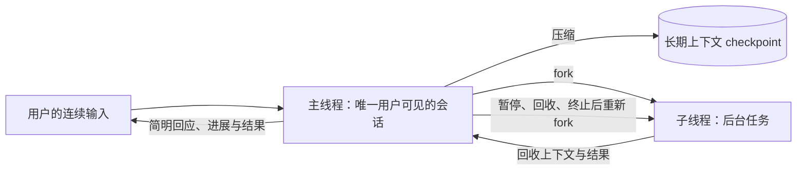
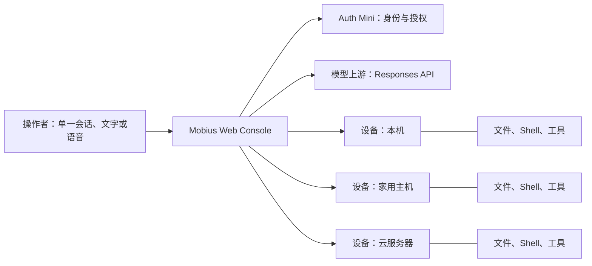
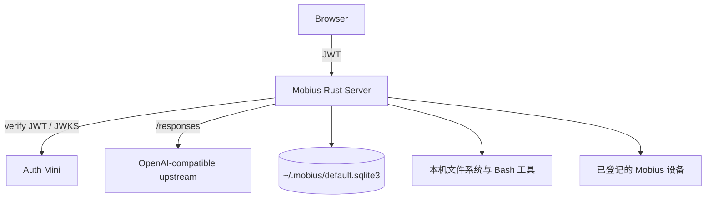

# Mobius

**Mobius 是面向多台设备、可长期使用的 AI Harness。** 它不要求人管理项目和
会话：用户在一个持久的长对话里描述想达成的结果，Mobius 将对话、工具和可接入的
机器组织为一个连续的操作界面。

Mobius 适合已经拥有本机、家用主机、云服务器等多种设备，并希望让 AI 在这些真实
机器上持续协作的个人操作员。它是实验性、高信任度的软件；授权后的 Agent 可以使用
文件系统和 Shell，因此只应部署在你愿意授予该权限的机器上。

> 当前版本已提供单机持久对话、Web GUI、Auth Mini 身份验证、OpenAI-compatible
> Responses API 上游、文件与 Shell 工具，以及机器登记。长对话的自动压缩折叠和跨
> 机器任务编排是正在推进的产品方向，尚不应视为已完成能力。

## 为什么还要做一个 Harness？

Claude Code、ChatGPT（Codex）、Pi、OpenCode、OpenClaw、Hermes 等产品已经证明了
Agent Harness 的价值。Mobius 的出发点不是再复制一个终端代理，而是重新选择三个
核心对象：**对话、入口和设备**。

### 1. 单一会话：围绕人的思考带宽设计

人类用户的思考带宽有限：同一时间只能稳定地持有少量目标、判断和上下文。Harness
应当适应这一限制，把用户的意图、过程和结果留在一条连续的对话中，而不是要求用户为
机器的会话、项目和目录模型不断创建、切换与拼接上下文。

许多 Harness 将项目目录和会话作为用户需要显式创建、打开、切换和归档的对象。使用
一段时间后，用户往往会积累大量已结束但又不敢确定可以删除的会话。所谓“归档”通常
发生在新会话自然覆盖旧会话之后，而不是一次明确、可靠的人类决策。

项目也是类似的问题。现代软件工作常由许多短生命周期的小任务组成；先创建目录，再
显式用 Harness 打开它，既增加了操作，也把对话人为地限制在目录边界内。跨项目沟通
因此变得别扭。对话不应成为用户需要管理的对象；系统应当围绕用户持续推进的思考来
组织信息。

Mobius 将用户界面收敛为**单一会话**：所有沟通都在这里发生，记录会持久化。它不只是
“持续对话”，而是以人能够连续思考和判断为中心的交互边界。随着模型能力与上下文窗口
扩大，产品方向是将长期积累的信息以可追溯的方式压缩、折叠并编译进当前上下文，使更
多相关信息能够同时参与推理。

只要关键信息仍在上下文窗口之外，模型就无法在一次推理中完整利用它；Agent 最终仍需
通过多轮检索从文件、工具、设备和历史记录中重新获取。检索是必要的环境能力，但不应
替代对长期信息的上下文组织。Mobius 因此追求让单一会话可以长期继续，而不是要求用户
判断何时结束一段 Session，或由用户承担跨会话恢复上下文的工作。

单一会话也是纯语音交互的前提。设想用户戴着耳机、同时处理其他事情：他可以随时向
Mobius 追加指令，Mobius 在任务完成或需要判断时主动语音播报。人无法同时有效接收两条
独立的音频流，因此指令、任务进展和播报必须归属于同一条有序、可持续的对话。否则，
用户仍要自行判断该听哪个 Agent、哪段任务和哪条通知，语音交互不会减少认知负担。

### 2. 主线程与子线程：一个面向人的入口，多个可回收的执行分支

**主线程 (Main Thread)** 是与用户直接对话的 AI 会话线程，也是单一会话在系统中的
实现形式。用户始终只面对主线程；它维护长期对话的主线，定期压缩上下文并保存
checkpoint，以保留可用于后续推理的长期上下文。

主线程还负责子线程的整个生命周期：

- **分发：**从当前主线程 fork 出子线程，执行不需要用户持续盯着的后台任务。
- **回收：**取回子线程产生的上下文、结果和可复用的环境认识，将它们合并回主线程。
- **终止：**在任务完成、不再相关或需要重建时终止子线程，避免后台工作成为用户需要
  管理的会话。

主线程采用 **MIMO (多入多出式交互)**：它应快速接收用户连续不断的输入，先给出
简明扼要的回应，而一次输入可以得到多次输出，例如即时确认、任务进展、完成结果或
需要用户判断的提示。这样，后台任务仍在推进时，用户无需等待它结束才能继续思考和
下达下一条指令。

**子线程 (Subthread)** 承担与传统 Harness Thread 相近的后台探索和执行职责，但它不从
完全空白的上下文开始。每个子线程都从主线程 fork，携带主线程已编译的 checkpoint 和
当前任务所需的上下文。当新的用户消息需要改变子线程的目标时，主线程可以先暂停该
子线程，回收并合并其上下文，终止旧子线程，再从更新后的主线程重新 fork。新的子线程
因此继承已回收的工作成果，不必从零开始重新探索环境。



主线程与子线程的编排是正在推进的产品方向，尚不应视为当前版本已完成能力。

### 3. 易用性：随时介入，并为更多交互设备准备

易用性不只是移动端适配。用户应当能以最自然、最方便的方式继续同一条对话：在桌面上
输入和查看执行过程，在手机或平板上随时查看进展、补充目标，或直接用语音表达意图。
语音输入是 Mobius 的一等交互方式，而不是桌面键盘输入的附属功能。

移动端必须存在，因为用户的工作和判断不会只发生在电脑前。Web GUI 让手机、平板或
任意浏览器都能回到同一条对话；它不把移动端限定为某个桌面应用的附属能力。Mobius
使用 Rust HTTP Server 承载嵌入式控制台，通过 Auth Mini 处理身份验证，并使用
OpenAI-compatible Responses API 连接模型上游。

这条交互路径也为未来的纯语音交互，以及 AI 音箱、车载智能等更多设备形态奠定基础。
耳机中的主动语音播报与连续语音指令属于这些产品方向；当前版本已经提供浏览器中的
语音输入和跨设备 Web 入口。

### 4. 设备是 AI 所在的真实世界

个人可控制的计算环境天然是多样的：Mac、Linux、Windows、云服务器和家中的主机各自
拥有文件、进程、网络与工具。Mobius 把它们视为可登记的设备，而不是散落在不同项目
里的孤立工作区。

每台设备运行自己的后端，并以同一 Auth Mini 身份体系验证操作者。设备可经公网地址、
反向代理或其他连通方式加入控制范围。AI 在执行时应当知道自己能够进入哪些设备，并只
加载完成当前任务所需的环境信息；这使多设备协作有清晰的上下文边界，也避免把所有
机器的细节塞进每一次对话。



### 5. 部署不应限制控制范围

控制家里的机器不应以拥有公网 IP 为前提。每台设备只需运行一个 Mobius 二进制；没有
公网 IP 的设备也可以通过 frp、cloudflared 或同类出站隧道建立可访问地址，再由同一
身份体系验证操作者。这样，用户可以从任意已登录的浏览器介入自己的设备，而不必先将
家用网络改造成公开服务器。

远程控制台仍应经 HTTPS 暴露，并只部署在你愿意授予文件系统和 Shell 权限的机器上。
网络连通解决访问问题，Auth Mini 和设备端的授权边界仍负责限制谁能够操作这些机器。

## 当前能力

- 一个持久化的对话记录，Agent 的工具调用过程实时流式显示。
- 内嵌中英双语 Web GUI，支持亮/暗主题、语音输入、文件浏览和编辑。
- 可配置的文件系统、Bash 与网页搜索工具集；工具在当前机器上执行。
- Auth Mini JWT 验证，以首次初始化时绑定的 root user 作为操作边界。
- 机器登记、资源监控，以及完整的自更新流程：正式运行二进制固定在 `~/.mobius/bin/mobius`；启动后和每六小时检查 Release、校验并下载候选版本、在设置页展示状态，并由操作者确认重启安装。一次性更新助手会先原子替换安装文件，再等待旧 PID 退出；系统服务重新拉起的新进程或助手启动的新进程会以预期版本写入启动标记，确认失败则恢复并重启旧二进制。
- Rust 单二进制部署：控制台资源嵌入二进制，运行时无需命令行参数或环境变量。

如果通过系统服务启动 Mobius，服务的 `Program` 必须是 `~/.mobius/bin/mobius`；不要指向
`target/release` 或 Release 解压目录。它们只用于首次迁移，运行中的更新不依赖常驻守护进程。

## 架构与边界

Mobius 不采用“每个目录一个项目”的隔离模型。它以设备为执行边界，以身份为访问边界：
一旦某台设备被初始化并授权，Agent 可以在该设备上使用已启用的工具。因此，机器的
选择、网络暴露方式和上游 API 凭据都属于操作者的安全责任。



安全模型的关键事实：

- 所有 `/api/*` 请求都必须携带有效的 Auth Mini EdDSA JWT；服务端校验 issuer、请求
  host 对应的 audience，以及与 `root_user_id` 一致的 subject。
- 浏览器使用 Auth Mini 的 SDK 处理会话刷新；Mobius 服务端只缓存用于验证的 JWKS，
  不读取浏览器 refresh token。
- 健康检查与嵌入式 Web 资源是公开路由。将远程控制台公开到互联网前，必须放在 HTTPS
  反向代理之后；Auth Mini 只允许精确的 loopback host 使用纯 HTTP 回调。

## 快速开始

前置条件：一个可用的 Auth Mini 服务和 OpenAI-compatible Responses API 上游。

### 优先：安装 Release

从 [GitHub Releases](https://github.com/zccz14/mobius/releases/latest) 下载与你的设备
匹配的归档和同名 `.sha256` 文件：

| 平台 | 归档 |
| --- | --- |
| macOS Apple Silicon | `mobius-macos-aarch64.tar.gz` |
| Linux x86_64 | `mobius-linux-x86_64.tar.gz` |
| Linux arm64 | `mobius-linux-aarch64.tar.gz` |

校验下载后解压并运行二进制。例如，在 macOS Apple Silicon 上：

```bash
shasum -a 256 -c mobius-macos-aarch64.tar.gz.sha256
tar -xzf mobius-macos-aarch64.tar.gz
./mobius-macos-aarch64/mobius
```

Mobius 默认监听 `0.0.0.0:1858`，数据存储在 `~/.mobius/default.sqlite3`。

### 后备：从源码构建

当你的平台没有对应 Release 时，安装 Rust 和 Node.js 后运行：

```bash
npm --prefix web install
npm --prefix web run build
cargo run --release
```

无论使用 Release 还是源码构建，首次启动后：

1. 打开 `http://localhost:1858`。
2. 确认 Auth Mini issuer：默认是 `https://auth.ntnl.io`，然后完成登录。
3. 输入 API key 和默认模型；模型上游 Base URL 默认是
   `https://openai.ntnl.io/v1`。

首次初始化会将已验证的 Auth Mini `sub` 写为 `app_meta.root_user_id`，并永久关闭初始化
接口。之后，只有该 root user 的有效 JWT 可以访问 API。

### 接入另一台机器

在另一台设备上重复上面的构建与首次初始化，并使用同一个 Auth Mini 身份体系。为该设备
配置 HTTPS 可访问地址后，在控制台的 **Machines** 页面添加其 Mobius URL。各设备独立
验证操作者的 JWT 和 root user 身份。

## 开发

```bash
npm --prefix web run check
npm --prefix web run build
cargo fmt --check
cargo clippy --all-targets -- -D warnings
cargo test
```

Rust 二进制会通过 `include_bytes!` 嵌入 `web/dist`，因此在全新克隆中执行 Rust 检查前
需要先构建 Web 应用。推送 `v*` Git tag 会触发 GitHub Actions，构建 macOS arm64、Linux
x86_64 和 Linux aarch64 的发布归档与 SHA-256 校验和。

## 路线图

- 以主线程对长对话进行可审计的压缩、折叠、checkpoint 保存与上下文编译。
- 从主线程 fork、回收和终止子线程，使后台工作继承上下文并回归同一会话。
- 支持 MIMO：持续接收用户输入，提供即时简短回应、任务进展与完成结果等多次输出。
- 在一个控制台中选择设备、委派任务并回收跨设备执行结果。
- 将设备能力、可达性和工作上下文以最小必要信息提供给 Agent。
- 保持部署、初始化与权限管理可通过 Web API 和 GUI 完成。

Mobius 的目标不是让人维护更多的 Project、Session 或机器列表，而是让这些对象退到
系统内部，让用户专注于自己要完成的事情。
