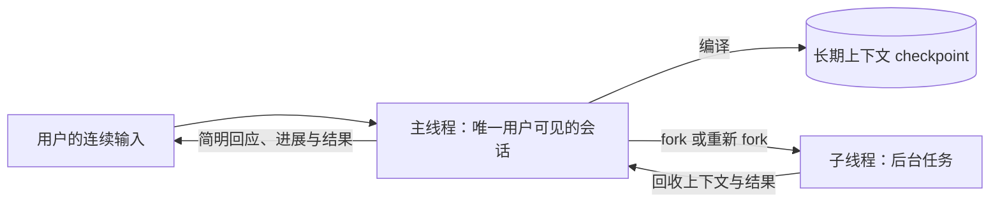
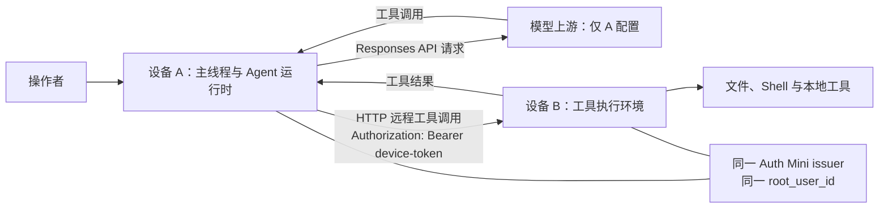
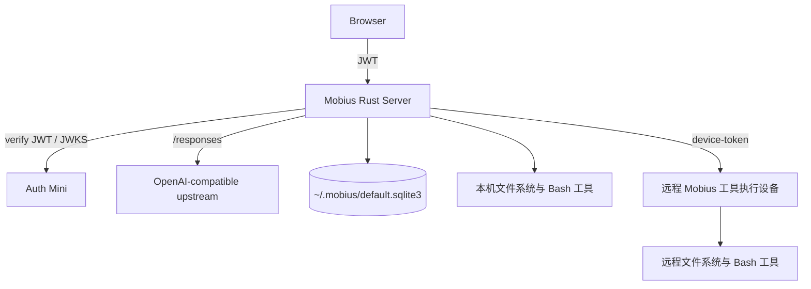

# Mobius

**Mobius 是面向多台设备、可长期使用的 AI Harness**。它以用户可见的一条持续对话
作为主线，将工具和可接入的机器组织为连续的操作界面，而不要求人管理项目和会话。

Mobius 适合已经拥有本机、家用主机、云服务器等多种设备，并希望让 AI 在这些真实
机器上持续协作的个人操作员。它是实验性、高信任度的软件；授权后的 Agent 可以使用
文件系统和 Shell，因此只应部署在你愿意授予该权限的机器上。

> 当前版本已提供持久化主线程、可回收子线程、上下文 checkpoint 与稳定前缀编译、
> Web GUI、Auth Mini 身份验证、OpenAI-compatible Responses API 上游、本机与远程文件
> 和 Shell 工具、设备 Token、控制/执行设备角色，以及浏览器中的连续语音输入和主动
> 播报。控制设备还可启动严格隔离的 Browser Control 会话；启用 Computer Use 时，模型的
> 视觉操作在高影响动作前必须由操作者批准。AI 音箱、车载智能等专用交互设备仍是产品方向。

## 为什么还要做一个 Harness？

Claude Code、ChatGPT（Codex）、Pi、OpenCode、OpenClaw、Hermes 等产品已经证明了
Agent Harness 的价值。Mobius 的出发点不是再复制一个终端代理，而是围绕三个核心对象
组织产品：**对话系统、用户入口和设备**。对话系统承载用户持续推进的思考，入口让用户
能在合适的时刻介入，设备则是 Agent 实际可以操作的世界。

### 1. 单一会话：围绕人的思考带宽设计

人类用户的思考带宽有限：同一时间只能稳定地持有少量目标、判断和上下文。Harness
应当适应这一限制，把用户的意图、过程和结果留在一条连续的对话中，而不是要求用户为
机器的会话、项目和目录模型不断创建、切换与拼接上下文。

许多 Harness 将项目目录和会话作为用户需要显式创建、打开、切换和归档的对象。使用
一段时间后，用户往往会积累大量已结束但又不敢确定可以删除的会话。所谓“归档”通常
发生在新会话自然覆盖旧会话之后，而不是一次明确、可靠的人类决策。

项目也是类似的问题。现代软件工作常由许多短生命周期的小任务组成；先创建目录，再
显式用 Harness 打开它，既增加了操作，也把对话人为地限制在目录边界内。跨项目沟通
因此变得别扭。对话不应成为用户需要管理的对象；系统应当围绕用户持续推进的思考来
组织信息。

Mobius 将用户界面收敛为**单一会话**：所有沟通都在这里发生，记录会持久化。它不只是
“持续对话”，而是以人能够连续思考和判断为中心的交互边界。系统负责维护这条主线和
上下文，用户不需要判断何时结束一段 Session，也不需要自行恢复跨会话的背景。

### 2. one more step：用真实反馈驱动迭代

真实工作往往无法在开始时被完整理解。用户的目标会随着新信息而改变，Agent 也只有在
读取文件、运行工具、观察环境和拿到中间结果之后，才知道接下来最有价值的动作是什么。
把尚未发生的过程过早固化，只会让系统花费精力维护猜测，而不是解决眼前的问题。

Mobius 的迭代哲学是 **one more step**：依据当前对话、已有产物、工具反馈和可验证证据，
选择并完成下一个有用步骤；结果返回后，把新事实合并回主线程，再重新判断下一步。每一步
都应推动真实结果向前，同时保留用户随时介入、改变方向或停止的空间。长期工作因此来自
连续而可追溯的迭代，而不是要求 AI 在一开始就知道完整路径。

### 3. 主线程与子线程：一个面向人的入口，多个可回收的执行分支

**主线程 (Main Thread)** 是与用户直接对话的 AI 会话线程，也是单一会话在系统中的
实现形式。用户始终只面对主线程；它维护长期对话的主线，并负责把完整历史编译为当前
推理所需的上下文。

主线程还负责子线程的整个生命周期：

- **分发**：从当前主线程 fork 出子线程，执行不需要用户持续盯着的后台任务。
- **回收**：取回子线程产生的上下文、结果和可复用的环境认识，将它们合并回主线程。
- **终止**：在任务完成、不再相关或需要重建时终止子线程，避免后台工作成为用户需要
  管理的会话。

主线程采用 **MIMO (多入多出式交互)**：它应快速接收用户连续不断的输入，先给出
简明扼要的回应，而一次输入可以得到多次输出，例如即时确认、任务进展、完成结果或
需要用户判断的提示。这样，后台任务仍在推进时，用户无需等待它结束才能继续思考和
下达下一条指令。

**子线程 (Subthread)** 承担与传统 Harness Thread 相近的后台探索和执行职责，但它不从
完全空白的上下文开始。每个子线程都从主线程 fork，携带主线程已编译的 checkpoint 和
当前任务所需的上下文。当新的用户消息需要改变子线程的目标时，主线程可以先暂停该
子线程，回收并合并其上下文，终止旧子线程，再从更新后的主线程重新 fork。新的子线程
因此继承已回收的工作成果，不必从零开始重新探索环境。

主线程和所有子线程都在控制设备本机运行并发起模型推理。线程本身不绑定设备；本机或
远程设备的选择只属于一次具体的文件系统或 Bash 工具调用，因此同一个线程可以在连续的
工具调用中操作不同设备。



### 4. 上下文是历史记录的函数

主线程的完整历史记录是上下文的事实来源。理想情况下，推理模型应当看到全部主线程
对话记录；如果用 `H_t` 表示从会话开始到时刻 `t` 的全部历史，用 `C_t` 表示传给模型的
上下文参数，那么目标是：

```text
C_t = f(H_t)
```

用户会持续使用 Mobius，`H_t` 会不断增长，而推理模型的上下文窗口始终有限。两者的
矛盾需要通过上下文自动压缩解决；这是 Harness 的经典做法，Mobius 保留这一做法，而不
把压缩后的上下文当作独立于历史记录的另一份真相。只要关键信息仍在上下文窗口之外，
模型就无法在一次推理中完整利用它，最终仍需通过多轮检索从历史记录、文件、工具和
设备中重新获取。

每次压缩都会产生一个 **checkpoint**，它代表截至某个历史位置的压缩结果。正常构造
上下文时，从最新记录向较早记录回溯到最近的 checkpoint 即可停止；按时间顺序将该
checkpoint 与其后的历史切片映射为最终上下文：

```text
K_c = compress(H_0 ... H_c)
C_t = map(K_c, H_(c+1) ... H_t)
```

完整的 `H_t` 仍会持久保存、可追溯；`K_c` 只是在有限窗口内高效表示较早历史的边界。
在两次压缩之间，系统保持 checkpoint 前缀不变，只在末尾追加新的对话记录。

当前实现不会依靠固定字符阈值提前压缩。主线程或子线程先以完整的 `K_c` 和后续原文
发起正常的 Responses 请求；只有上游返回结构化的上下文窗口溢出错误时，才进入压缩
恢复。恢复请求传入完整的 `K_c` 和全部后缀原文，但不传入工具定义、技能或原 Agent
执行指令，只带专用提炼指令。它要求模型以 Markdown 提炼目标、决策、约束、未完成工作、
证据、工具结果、错误和精确标识符；每条可长期复用的事实必须附带出现它的消息 ID。正式
输出成为 `K_(c+1)`，替换此前 checkpoint 与全部后缀，再用该 checkpoint 对原请求自动
重试一次：

```text
K_(c+1) = distill(K_c, H_(c+1) ... H_t)
C_retry = map(K_(c+1))
```

Mobius 因此具备面向无限长历史的上下文管理能力：每条主线程消息都有递增 ID，原文和
工具执行记录永久保留；checkpoint 记录其覆盖的 ID 区间、前序 checkpoint 和一棵平衡的
历史范围索引。`get_checkpoint` 可以按 checkpoint ID 取得摘要，也可以按消息 ID 在索引中
以对数级跳数定位到对应的原文范围；`read_thread_history` 再分页读取该范围的原始证据。
消息范围查询的成本为 `O(log N + k)`，其中 `k` 是实际返回的消息数，而不是整个历史长度。

长期记忆是附带来源的事实修订索引：它只收录明确表达或稳定验证的协作偏好、项目和权威
数据路径、持久配置、设备或服务状态；每项都保存消息 ID、checkpoint 引用和
`current`、`superseded` 或 `uncertain` 状态。新的同 key 事实会合并为新修订而保留旧来源，
Agent 可以通过 `search_thread_memory` 检索，再按引用展开 checkpoint 或原文。系统不会把
Token、密码、API key、Cookie 或其他密钥写入这个索引，也不会根据对话推断人格特征。

这并不表示任何模型的单次请求能容纳无限 token。单次推理仍只接收有限的 checkpoint、
最近原文和记忆目录；当它需要较早细节时，按消息 ID 逐步取回可审计的证据。主线程的
`K_(c+1)` 会写入持久化 checkpoint；子线程的 `K_(c+1)` 会写回该子线程的上下文快照，以便
重启后复用。压缩结果不是第二份事实来源。控制台会显示当前 checkpoint、历史消息数与
长期记忆目录。服务重启时只恢复尚未开始执行的输入；已经开始调用工具的运行会明确标记
失败而不会自动重放，以免重复产生副作用。

### 5. 易用性：从任意入口随时介入

易用性不只是移动端适配，而是让用户在合适的时刻以合适的方式回到同一条主线程：在
桌面上输入和查看执行过程，在手机或平板上随时查看进展、补充目标，或直接用语音表达
意图。语音输入是 Mobius 的一等交互方式，而不是桌面键盘输入的附属功能。

移动端必须存在，因为用户的工作和判断不会只发生在电脑前。Web GUI 让手机、平板或
任意浏览器都能回到同一条对话；它不把移动端限定为某个桌面应用的附属能力。Mobius
使用 Rust HTTP Server 承载嵌入式控制台，通过 Auth Mini 处理身份验证，并使用
OpenAI-compatible Responses API 连接模型上游。

这条交互路径也为未来的纯语音交互，以及 AI 音箱、车载智能等更多设备形态奠定基础。
例如，用户戴着耳机、同时处理其他事情时，可以随时追加指令，并在任务完成或需要判断
时听到主动播报。人无法同时有效接收两条独立的音频流，因此指令、进展和播报必须归属
于同一条有序、可持续的主线程；否则语音交互不会减少认知负担。当前浏览器 Web GUI 提供
自动静音分段的连续语音输入和按主线程顺序播放的主动播报；AI 音箱、车载智能等专用
设备形态仍是产品方向。

### 6. 设备是可远程调用的执行环境

个人可控制的计算环境天然是多样的：Mac、Linux、Windows、云服务器和家中的主机各自
拥有文件、进程、网络与工具。Mobius 将它们视为可由远程工具调用的执行环境，而不是
必须各自运行 AI 推理的孤立工作区。

推理集中在控制设备 A：A 上的主线程向配置在 A 上的 Responses API 上游发起请求，并把
远程设备 B 的能力作为可调用工具提供给该次推理。当模型选择该工具时，A 的 Agent 运行时
向 B 发起 HTTP 请求，B 执行文件、Shell 或其他本地工具并返回结果；工具结果回到 A，
继续同一条主线程的推理。B 不发起 AI 推理请求，因此作为纯执行设备时不需要配置
OpenAI Responses 上游。

远程调用需要独立于用户登录的设备授权。B 在允许 A 访问时创建设备访问 Token，A 将该
Token 保存在本机；之后 A 对 B 的工具请求携带 `Authorization: Bearer <device-token>`。
该 Token 用于识别并限制 A 对 B 的调用权限。与此同时，所有设备必须使用同一个 Auth
Mini issuer 初始化，并以同一个用户的 `sub` 作为 `root_user_id`；共享 root 身份证明它们
属于同一操作者，设备 Token 则授权具体的设备间调用。



当前版本已经实现这条调用路径：执行设备可以在初始化或设置页选择“工具执行设备”角色，
无需配置模型上游；它由 root user 创建只显示一次、只保存 SHA-256 哈希的设备 Token，
并分别授权文件系统和 Bash。控制设备使用该 Token 接入远端时，会验证双方使用同一个
Auth Mini issuer 和 `root_user_id`，并只把设备 ID、可达性和获准能力提供给 Agent。主线程
和子线程使用同一组文件系统与 Bash 工具：省略可选的 `target_device` 或将它填为空字符串时，
在控制设备本机执行；填写已接入的设备 ID 时只把这一次工具调用转发到对应设备。子线程完成后的结果仍会
自动回收到同一条主线程。

### 7. 部署不应限制控制范围

控制家里的机器不应以拥有公网 IP 为前提。每台设备只需运行一个 Mobius 二进制；没有
公网 IP 的设备也可以通过 frp、cloudflared 或同类出站隧道建立可访问地址，再由同一
身份体系验证操作者。这样，用户可以从任意已登录的浏览器介入自己的设备，而不必先将
家用网络改造成公开服务器。

远程控制台仍应经 HTTPS 暴露，并只部署在你愿意授予文件系统和 Shell 权限的机器上。
网络连通解决访问问题；操作者 API 由 Auth Mini JWT 保护，远程工具调用由设备 Token
和共享 `root_user_id` 限制设备间的权限。

## 当前能力

- 一个持久化的对话记录，Agent 的工具调用过程实时流式显示；主线程输入固定在控制设备
  Web GUI 的全局底部区域，用户在任意页面都可以继续向同一条主线程输入。
- Agent 以 **one more step** 推进：根据当前历史、工具反馈和证据完成下一步，再用新结果
  重新判断方向，并允许用户在任意一次结果后介入或改变方向。
- 持久化的 MIMO 主线程：连续输入会立即入库并按顺序执行，一次输入可以依次产生已接收、
  上下文编译、工具进展和完成结果；刷新浏览器不会丢失已接受的输入。
- 溢出驱动的自动上下文 checkpoint、长期保留的原文和工具记录、平衡范围索引与带来源的
  长期事实修订；Agent 可用 `get_checkpoint`、`read_thread_history` 和
  `search_thread_memory` 按需展开历史，主线程和子线程使用相同的压缩提炼算法。
- 从主线程 fork、终止和自动回收的后台子线程；主线程与子线程分别配置模型。Threads
  页面将主线程固定置顶，后面列出尚未回收的子线程及其状态和模型；主线程链接回到可交互
  的控制台，子线程详情页复用主线程控制台的消息、状态和工具调用渲染，先读取完整持久化
  内容，再通过 SSE 只读追加实时内容。子线程不能接收 prompt，回收后会自动从列表与详情中
  移除，不形成第二套 Session。对应 HTTP API 统一使用 `/api/threads` 前缀。
- 内嵌中英双语 Web GUI，支持亮/暗主题、语音输入、文件浏览和编辑。
- 浏览器连续语音输入和按主线程顺序播放的主动语音播报。
- **Browser Control 与 Computer Use**：Agent 可自主创建、列出、聚焦与关闭独立的临时 Chromium
  会话；结构化 DOM 操作显式携带 session ID，因此 Agent 能同时操纵所有会话。会话可访问任意
  HTTP(S) 网页；启用原生 Computer Use 后，Agent 先聚焦一个会话，再由 Responses `computer`
  工具驱动其截图、点击、输入和滚动。提交表单、敏感字段、Enter 与 Computer Use 的点击/输入
  会暂停，直到控制台明确批准。会话关闭即销毁 profile；不会接管用户日常浏览器或读取其 cookie、
  扩展和主机环境变量。
- 可配置的文件系统、Bash 与网页搜索工具集；`list_files`、`read_file`、`write_file`、
  `edit_file` 和 `run_bash` 都接受可选的 `target_device`，省略或填空字符串时在控制设备本机执行。
  每次 Bash 调用会在开始时持久化记录命令、目标机器和 `running` 状态，并在【命令】页以可展开的
  列表展示返回结果、退出码、结束时间和 `complete` 或 `cancelled` 终态；可按状态、目标机器和
  关键词筛选并分页浏览，正在运行的命令固定排在前面。
- Auth Mini JWT 验证，以首次初始化时绑定的 root user 作为操作边界；浏览器在每次 API 或
  SSE 请求前检查 access token 有效期，临近过期时刷新，并在 401 后刷新重试一次。
- 设备 Token、远程文件与 Shell 工具，以及控制/执行设备角色；执行设备无需 Responses API
  上游，设备只在单次工具调用中被选择。
- 机器登记、远程状态探测、资源监控，以及完整的自更新流程：正式运行二进制固定在 `~/.mobius/bin/mobius`；启动后和每六小时检查 Release、校验并下载候选版本、在设置页展示状态，并由操作者确认重启安装。一次性更新助手会先原子替换安装文件，再等待旧 PID 退出；系统服务重新拉起的新进程或助手启动的新进程会以预期版本写入启动标记，确认失败则恢复并重启旧二进制。
- Rust 单二进制部署：控制台资源嵌入二进制，运行时无需命令行参数或环境变量。

如果通过系统服务启动 Mobius，服务的 `Program` 必须是 `~/.mobius/bin/mobius`；不要指向
`target/release` 或 Release 解压目录。它们只用于首次迁移，运行中的更新不依赖常驻守护进程。

## 架构与边界

Mobius 不采用“每个目录一个项目”的隔离模型。主线程和子线程始终运行在控制设备本机，
每次文件或 Bash 工具调用以 `target_device` 选择本机或远程执行边界，并以身份和设备 Token
作为访问边界。一旦设备被初始化并授权，Agent 可以使用获准的文件与 Shell 工具。因此，
设备的选择、网络暴露方式和上游 API 凭据都属于操作者的安全责任。



安全模型的关键事实：

- 操作者使用的 `/api/*` 请求必须携带有效的 Auth Mini EdDSA JWT；服务端校验 issuer、
  请求 host 对应的 audience，以及与 `root_user_id` 一致的 subject。`/api/remote/*` 只接受
  单独创建设备 Token，不接受或转发浏览器 JWT。
- 浏览器使用 Auth Mini 的 SDK 持久保存会话，并在 API 与 SSE 请求前主动刷新即将过期的
  access token；遇到 401 时只刷新重试一次。Mobius 服务端只缓存用于验证的 JWKS，不读取
  浏览器 refresh token。
- Browser Control 只在控制设备上运行：它以空环境变量、临时 user-data directory、禁用扩展和
  loopback-only CDP 启动 headless Chrome/Chromium。Agent 可访问任意 HTTP(S) 网页；页面文字、
  邮件、PDF 和网页内提示都是不可信内容，不能构成操作授权。
- 设备 Token 的明文只在创建时显示一次；执行设备只保存 SHA-256 哈希。控制设备为调用
  远端而在自己的 SQLite 中保存明文 Token。Token 可分别限制文件系统和 Bash，并可随时
  撤销。
- 健康检查与嵌入式 Web 资源是公开路由。将远程控制台公开到互联网前，必须放在 HTTPS
  反向代理之后；Auth Mini 只允许精确的 loopback host 使用纯 HTTP 回调。

## 快速开始

前置条件：一个可用的 Auth Mini 服务和 OpenAI-compatible Responses API 上游。

若要使用 Browser Control，控制设备还需要安装 Google Chrome 或 Chromium。Mobius 不使用或
修改用户的日常浏览器 profile；Computer Use 还要求当前配置的 Responses 上游与模型支持
`computer` 工具。

### 优先：安装 Release

从 [GitHub Releases](https://github.com/zccz14/mobius/releases/latest) 下载与你的设备
匹配的归档和同名 `.sha256` 文件：

| 平台 | 归档 |
| --- | --- |
| macOS Apple Silicon | `mobius-macos-aarch64.tar.gz` |
| Linux x86_64 | `mobius-linux-x86_64.tar.gz` |
| Linux arm64 | `mobius-linux-aarch64.tar.gz` |

校验下载后解压并运行二进制。例如，在 macOS Apple Silicon 上：

```bash
shasum -a 256 -c mobius-macos-aarch64.tar.gz.sha256
tar -xzf mobius-macos-aarch64.tar.gz
./mobius-macos-aarch64/mobius
```

Mobius 默认监听 `0.0.0.0:1858`，数据存储在 `~/.mobius/default.sqlite3`。

### 后备：从源码构建

当你的平台没有对应 Release 时，安装 Rust 和 Node.js 后运行：

```bash
npm --prefix web install
npm --prefix web run build
cargo run --release
```

无论使用 Release 还是源码构建，首次启动后：

1. 打开 `http://localhost:1858`。
2. 确认 Auth Mini issuer：默认是 `https://auth.ntnl.io`，然后完成登录。
3. 选择部署角色。控制设备输入 API key 和默认模型；模型上游 Base URL 默认是
   `https://openai.ntnl.io/v1`。工具执行设备不需要模型上游。

首次初始化会将已验证的 Auth Mini `sub` 写为 `app_meta.root_user_id`，并永久关闭初始化
接口。之后，只有该 root user 的有效 JWT 可以访问 API。

### 接入另一台工具执行设备

1. 在另一台设备上重复安装，使用同一个 Auth Mini issuer 和同一用户初始化，并选择
   **工具执行设备**。没有公网 IP 时，可通过 frp、cloudflared 或同类出站隧道建立 HTTPS
   地址；只有精确 loopback 地址可使用 HTTP。
2. 在执行设备的 **Machines** 页面创建仅含必要能力的设备 Token，立即复制只显示一次的
   密钥。
3. 在控制设备的 **Machines** 页面填写执行设备的 Mobius URL 和设备 Token。控制设备会
   调用远端状态接口，验证双方的 issuer、`root_user_id`、机器 ID 和获准能力后再保存。
4. 之后主线程或子线程调用文件系统与 Bash 工具时，可以填写 `target_device` 为该设备 ID；
   省略该字段则在控制设备本机执行。执行设备不会发起 Responses API 请求。

## 开发

```bash
npm --prefix web run check
npm --prefix web run build
cargo fmt --check
cargo clippy --all-targets -- -D warnings
cargo test
```

Rust 二进制会通过 `include_bytes!` 嵌入 `web/dist`，因此在全新克隆中执行 Rust 检查前
需要先构建 Web 应用。推送 `v*` Git tag 会触发 GitHub Actions，构建 macOS arm64、Linux
x86_64 和 Linux aarch64 的发布归档与 SHA-256 校验和。

## 路线图

- 对 checkpoint 压缩质量、长期事实召回、溢出恢复成功率和稳定前缀缓存命中率建立回放
  评测。
- 在现有浏览器连续语音和主动播报之上，接入 AI 音箱、车载智能等专用交互设备。
- 为设备 Token 增加路径和有效期等更细粒度的能力约束。
- 在不暴露 Session 管理的前提下，增强跨机器任务的设备建议、可达性诊断和结果证据视图。
- 继续保持部署、初始化与权限管理可通过 Web API 和 GUI 完成。

Mobius 的目标不是让人维护更多的 Project、Session 或机器列表，而是让这些对象退到
系统内部，让用户专注于自己要完成的事情。
