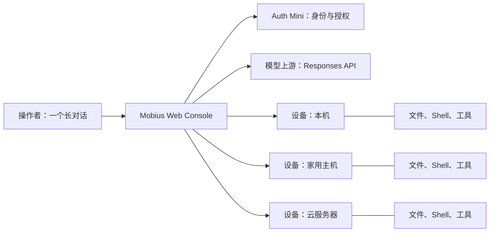
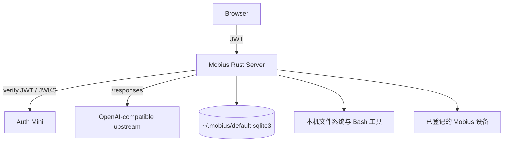

# Mobius

**Mobius 是面向多台设备、可长期使用的 AI Harness。** 它不要求人管理项目和
会话：用户在一个持久的长对话里描述想达成的结果，Mobius 将对话、工具和可接入的
机器组织为一个连续的操作界面。

Mobius 适合已经拥有本机、家用主机、云服务器等多种设备，并希望让 AI 在这些真实
机器上持续协作的个人操作员。它是实验性、高信任度的软件；授权后的 Agent 可以使用
文件系统和 Shell，因此只应部署在你愿意授予该权限的机器上。

> 当前版本已提供单机持久对话、Web GUI、Auth Mini 身份验证、OpenAI-compatible
> Responses API 上游、文件与 Shell 工具，以及机器登记。长对话的自动压缩折叠和跨
> 机器任务编排是正在推进的产品方向，尚不应视为已完成能力。

## 为什么还要做一个 Harness？

Claude Code、ChatGPT（Codex）、OpenCode、OpenClaw、Hermes 等产品已经证明了
Agent Harness 的价值。Mobius 的出发点不是再复制一个终端代理，而是重新选择三个
核心对象：**对话、入口和设备**。

### 1. 对话应持续，而不应成为待管理的对象

许多 Harness 将项目目录和会话作为用户需要显式创建、打开、切换和归档的对象。使用
一段时间后，用户往往会积累大量已结束但又不敢确定可以删除的会话。所谓“归档”通常
发生在新会话自然覆盖旧会话之后，而不是一次明确、可靠的人类决策。

项目也是类似的问题。现代软件工作常由许多短生命周期的小任务组成；先创建目录，再
显式用 Harness 打开它，既增加了操作，也把对话人为地限制在目录边界内。跨项目沟通
因此变得别扭。

Mobius 将用户界面收敛为**一个长对话**：所有沟通都在这里发生，记录会持久化。产品
方向是在不丢失可追溯性的前提下，对较早上下文进行压缩与折叠，让对话可以长期继续，
而不是要求用户判断何时结束一段 Session。

### 2. 浏览器是移动端参与的共同入口

移动端不应只是桌面 Agent 的旁路。Web GUI 能让用户在手机、平板或任意浏览器中查看
进展、补充目标，并回到同一条对话。Mobius 使用 Rust HTTP Server 承载嵌入式控制台，
通过 Auth Mini 处理身份验证，并使用 OpenAI-compatible Responses API 连接模型上游。

这也让部署保持直接：每台机器运行一个 Mobius 二进制；通过 HTTPS 反向代理，再配合
frp、cloudflared 或同类网络方案，即可在自己的域名下访问。Mobius 不把移动端限定为
某一个桌面应用的附属能力。

### 3. 设备是 AI 所在的真实世界

个人可控制的计算环境天然是多样的：Mac、Linux、Windows、云服务器和家中的主机各自
拥有文件、进程、网络与工具。Mobius 把它们视为可登记的设备，而不是散落在不同项目
里的孤立工作区。

每台设备运行自己的后端，并以同一 Auth Mini 身份体系验证操作者。设备可经公网地址、
反向代理或其他连通方式加入控制范围。AI 在执行时应当知道自己能够进入哪些设备，并只
加载完成当前任务所需的环境信息；这使多设备协作有清晰的上下文边界，也避免把所有
机器的细节塞进每一次对话。



## 当前能力

- 一个持久化的对话记录，Agent 的工具调用过程实时流式显示。
- 内嵌中英双语 Web GUI，支持亮/暗主题、语音输入、文件浏览和编辑。
- 可配置的文件系统、Bash 与网页搜索工具集；工具在当前机器上执行。
- Auth Mini JWT 验证，以首次初始化时绑定的 root user 作为操作边界。
- 机器登记、资源监控，以及完整的自更新流程：正式运行二进制固定在 `~/.mobius/bin/mobius`；启动后和每六小时检查 Release、校验并下载候选版本、在设置页展示状态，并由操作者确认重启安装。一次性更新助手会等待旧 PID 退出，再以新 PID 和预期版本写入启动标记；确认失败会恢复并重启旧二进制。
- Rust 单二进制部署：控制台资源嵌入二进制，运行时无需命令行参数或环境变量。

## 架构与边界

Mobius 不采用“每个目录一个项目”的隔离模型。它以设备为执行边界，以身份为访问边界：
一旦某台设备被初始化并授权，Agent 可以在该设备上使用已启用的工具。因此，机器的
选择、网络暴露方式和上游 API 凭据都属于操作者的安全责任。



安全模型的关键事实：

- 所有 `/api/*` 请求都必须携带有效的 Auth Mini EdDSA JWT；服务端校验 issuer、请求
  host 对应的 audience，以及与 `root_user_id` 一致的 subject。
- 浏览器使用 Auth Mini 的 SDK 处理会话刷新；Mobius 服务端只缓存用于验证的 JWKS，
  不读取浏览器 refresh token。
- 健康检查与嵌入式 Web 资源是公开路由。将远程控制台公开到互联网前，必须放在 HTTPS
  反向代理之后；Auth Mini 只允许精确的 loopback host 使用纯 HTTP 回调。

## 快速开始

前置条件：一个可用的 Auth Mini 服务和 OpenAI-compatible Responses API 上游。

### 优先：安装 Release

从 [GitHub Releases](https://github.com/zccz14/mobius/releases/latest) 下载与你的设备
匹配的归档和同名 `.sha256` 文件：

| 平台 | 归档 |
| --- | --- |
| macOS Apple Silicon | `mobius-macos-aarch64.tar.gz` |
| Linux x86_64 | `mobius-linux-x86_64.tar.gz` |
| Linux arm64 | `mobius-linux-aarch64.tar.gz` |

校验下载后解压并运行二进制。例如，在 macOS Apple Silicon 上：

```bash
shasum -a 256 -c mobius-macos-aarch64.tar.gz.sha256
tar -xzf mobius-macos-aarch64.tar.gz
./mobius-macos-aarch64/mobius
```

Mobius 默认监听 `0.0.0.0:1858`，数据存储在 `~/.mobius/default.sqlite3`。

### 后备：从源码构建

当你的平台没有对应 Release 时，安装 Rust 和 Node.js 后运行：

```bash
npm --prefix web install
npm --prefix web run build
cargo run --release
```

无论使用 Release 还是源码构建，首次启动后：

1. 打开 `http://localhost:1858`。
2. 确认 Auth Mini issuer：默认是 `https://auth.ntnl.io`，然后完成登录。
3. 输入 API key 和默认模型；模型上游 Base URL 默认是
   `https://openai.ntnl.io/v1`。

首次初始化会将已验证的 Auth Mini `sub` 写为 `app_meta.root_user_id`，并永久关闭初始化
接口。之后，只有该 root user 的有效 JWT 可以访问 API。

### 接入另一台机器

在另一台设备上重复上面的构建与首次初始化，并使用同一个 Auth Mini 身份体系。为该设备
配置 HTTPS 可访问地址后，在控制台的 **Machines** 页面添加其 Mobius URL。各设备独立
验证操作者的 JWT 和 root user 身份。

## 开发

```bash
npm --prefix web run check
npm --prefix web run build
cargo fmt --check
cargo clippy --all-targets -- -D warnings
cargo test
```

Rust 二进制会通过 `include_bytes!` 嵌入 `web/dist`，因此在全新克隆中执行 Rust 检查前
需要先构建 Web 应用。推送 `v*` Git tag 会触发 GitHub Actions，构建 macOS arm64、Linux
x86_64 和 Linux aarch64 的发布归档与 SHA-256 校验和。

## 路线图

- 对长对话进行可审计的压缩、折叠与上下文编译。
- 在一个控制台中选择设备、委派任务并回收跨设备执行结果。
- 将设备能力、可达性和工作上下文以最小必要信息提供给 Agent。
- 保持部署、初始化与权限管理可通过 Web API 和 GUI 完成。

Mobius 的目标不是让人维护更多的 Project、Session 或机器列表，而是让这些对象退到
系统内部，让用户专注于自己要完成的事情。
