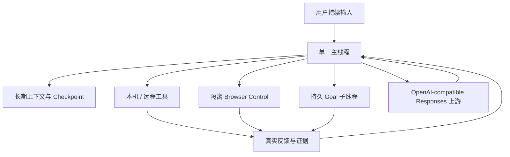

# Cybion：面向长期工作的 AI Harness

Cybion 是一个面向多台设备、长期使用的 AI Harness。它把用户的持续对话、可控的工具执行、远程设备和长期上下文组织在同一条工作主线上，让 AI 不只是回答一条消息，而是能够在真实环境中持续推进目标，并把每一步结果留在可追溯的上下文中。

Cybion 适合希望让 AI 协助操作本机、家庭设备、云服务器和浏览器的个人开发者、研究者与系统操作员。它属于高信任度工具：授权后的 Agent 可以执行文件系统和 Shell 操作，因此应只部署在你愿意授予相应权限的设备上。

> Cybion 的核心不是把任务拆成用户需要手工管理的项目和会话，而是保留一个面向人的连续入口，让系统围绕当前目标持续完成下一步有用工作。

## Cybion 解决什么问题？

现实工作通常不是一次提问、一次回答就能结束：需要读取资料、修改文件、运行命令、观察结果、验证部署，再根据新事实调整计划。传统的聊天记录容易在长任务中膨胀，传统的工具脚本又很难保留完整的判断过程。

Cybion 将这两部分结合起来：

```text
用户持续输入
      ↓
单一主线程：理解目标、保持上下文、回应用户
      ↓
工具 / 浏览器 / 远程设备：取得真实反馈
      ↓
持久 Goal：并行推进较长或独立的工作
      ↓
证据、结果与新事实回到主线程
```

每一步都以当前可验证的事实为依据。用户可以继续输入、改变方向、查看进展或停止任务，而不需要先设计一套完整的执行计划。

## 核心能力

### 单一用户可见主线程

Cybion 以一条持续对话作为用户入口。用户不需要为每个项目、设备或短任务创建并管理独立 Session。主线程负责维护整体目标、编译当前上下文，并把后台工作的结果交接回来。

主线程支持连续输入：用户可以在后台工作继续时补充约束、提出新问题或改变优先级，系统再根据最新输入和已验证结果继续推进。

### 持久 Goal 与后台子线程

较长、独立或适合并行的工作可以成为持久 Goal。每个 Goal 都有：

- 简短标题；
- 明确任务；
- 可验证的完成条件；
- 持续的进展、证据或阻塞原因。

Goal 不以一次自然语言回复作为完成标志。它会在每轮取得结果后继续排队，直到明确达成并提交证据，或明确说明需要什么外部变化才能继续。用户始终通过主线程与整体工作沟通，不需要管理第二套用户会话。

### 可控的本机与远程工具执行

Agent 可以在授权边界内使用：

- 文件系统读写；
- Bash 命令；
- 设备上的开发与运维工具；
- 已接入的远程执行设备。

设备选择属于具体工具调用，而不是线程属性。同一条对话可以在控制设备和远程设备之间切换操作。远程设备通过配对和明确的设备身份连接，工具调用结果会回到同一条上下文中。

Cybion 还提供受控的自更新 Tool。Agent 不需要通过 Shell 下载并重启当前 Cybion 进程；更新流程会验证 Release、持久化更新结果，再由独立的 update helper 完成安装和重启，避免自重启造成工具结果丢失与重复执行。

### 远程 Browser Control

Cybion 的 Browser Control 支持为浏览器会话指定目标设备。Agent 可以在已配对的 MacMini 或其他支持设备上创建隔离浏览器会话，并执行：

- 打开页面；
- 获取 DOM snapshot；
- 截图；
- 滚动和导航；
- 点击、输入与键盘操作。

浏览器 session 与创建它的设备绑定，不允许跨设备复用。浏览器页面内容被视为不可信输入；敏感输入、外部联系和高影响操作仍受现有审批边界控制。

### 长期上下文、Checkpoint 与 Chronicle

Cybion 将协议历史保存为可重放记录，并在上下文接近限制时生成持久化 checkpoint。Checkpoint 保存完成长期工作所需的当前状态，包括重要概念、资源、决定、约束、未完成工作和证据路径；完整历史仍可按需检索。

Chronicle timeline 是 checkpoint 中的长期因果时间线。它尽可能保留仍对当前理解有价值的事件，例如决定、发现、失败、恢复、验证和发布。重复事实或已被更高层结论覆盖的内容可以合并，但不采用固定条数上限，也不应因压缩而丢失关键因果链。

详见：

- [Context Layout 与上下文编译](context.md)；
- [上下文压缩](context_compacting.md)；
- [Time Awareness：时间感知](time_awareness.md)。

### 稳定的时间感知

长期任务可能跨越 UTC 日期边界。若 Agent 只依赖早期上下文中的日期，可能把后续工具结果中的新日期误判为“未来时间”，进而错误地认为系统、部署或外部服务异常。

Cybion 在编译上下文时，根据不可变 `history_records.created_at` 生成稳定的 UTC 时间锚点：

- 真实用户输入后追加对应的时间锚点；
- `function_call_output` 后追加对应的时间锚点；
- 时间锚点不写回历史数据库；
- 原始 `function_call_output` 仍保持标准 Responses API 结构；
- 同一历史记录的时间锚点稳定，因此不会因每次请求的动态当前时间破坏缓存前缀。

这样，Agent 可以区分“事件发生的时间”和“当前推理的时间顺序”，更可靠地处理跨日开发、部署和验证任务。

### 上游 Provider Affinity

Cybion 为每个主线程和持久子线程维护稳定的 UUID，并在发送给 OpenAI-compatible Responses 上游时使用稳定的 `thread-id` 请求头。

```text
同一 Cybion 线程
      ↓
稳定 UUID thread-id
      ↓
OpenAI-LB provider / channel affinity
```

同一线程的正常请求、工具循环、重试和上下文 checkpoint 会复用该 ID。这样，上游负载均衡层可以将同一工作流稳定地路由到合适的 Provider 或渠道，同时保持标准 Responses 协议不变。

### 可审计的 Responses 请求

每次 Responses 请求都有明确的审计边界，包括：

- 请求类型；
- 使用的模型；
- 请求状态；
- 输入、输出和缓存 token；
- 上下文覆盖范围；
- 上游审计关联信息；
- 错误与取消状态。

这使长任务中的上下文压缩、缓存命中、重复请求、上游失败和子线程执行都可以被定位，而不需要把运行日志混入可重放的对话事实。

## 一个典型工作流



例如，用户可以让 Cybion：

1. 检查一个远程服务的当前状态；
2. 在 MacMini 上阅读仓库并运行测试；
3. 将需要独立推进的发布工作 fork 为 Goal；
4. 在 Browser Control 中检查生产页面；
5. 根据工具反馈修正方案；
6. 在每一步完成后保留可追溯证据，并在最终结果中说明已验证的状态。

## 适用场景

### 研发与工程

- 跨多个仓库的功能开发与代码审查；
- 本地测试、CI 诊断和发布准备；
- 在 Mac、Linux 服务器和其他执行设备之间协调工作；
- 需要持续上下文的重构与迁移。

### 研究与资料整理

- 长期研究主题的资料收集、验证和归纳；
- 需要多轮工具反馈的分析任务；
- 将稳定结论、来源和未完成问题保留到 checkpoint；
- 使用 Chronicle 追踪关键发现与决定的形成过程。

### 运维与生产验证

- 检查服务状态、日志和部署产物；
- 在明确授权的设备上执行受控运维命令；
- 验证网页、API、认证边界和发布状态；
- 使用审计记录回溯请求、重试和失败原因。

## 与普通聊天工具的区别

| 维度 | 普通聊天 | Cybion |
| --- | --- | --- |
| 用户入口 | 多个会话或项目 | 一条持续的用户可见主线程 |
| 长任务 | 依赖用户手工续接上下文 | Checkpoint 与长期上下文自动维护 |
| 后台工作 | 常见为一次性任务 | 持久 Goal，直到达成或明确受阻 |
| 工具执行 | 通常绑定当前环境 | 本机与配对远程设备均可控 |
| 浏览器操作 | 依赖外部工具或单独流程 | 受控、隔离、可指定设备的 Browser Control |
| 时间理解 | 常依赖消息文本中的日期 | 基于不可变历史记录生成稳定 UTC 锚点 |
| 调试与追溯 | 结果和过程容易分离 | Responses 审计、协议历史与 Goal 证据可关联 |

## 安全边界

Cybion 适合高信任度部署。部署前应明确：

- 哪些设备允许 Agent 操作；
- 哪些 Shell 命令和文件系统具有高影响；
- 哪些浏览器操作必须由操作者批准；
- OpenAI-compatible 上游的 API Key 应如何保存；
- 远程设备如何配对、撤销和隔离；
- 生产更新应通过受控的 `update_cybion` 路径完成。

Cybion 不会把“AI 能够调用工具”当作安全保证。安全来自明确的部署边界、设备身份、凭证管理、审批和可审计的操作路径。

## 开始使用

建议先阅读：

1. [Context Layout](context.md)：了解 Cybion 如何编译长期上下文；
2. [上下文压缩](context_compacting.md)：了解 checkpoint 与长期状态；
3. [Time Awareness](time_awareness.md)：了解跨日期任务中的时间锚点；
4. [线程与 Goal](threads.md)：了解主线程、子线程和持久 Goal；
5. 项目现有部署与配置文档：根据部署角色、设备和上游服务设置权限。

Cybion 的目标很明确：让 AI 在真实设备和长期工作中保持连续、可验证、可追溯，并让用户始终保留介入和判断的权力。
