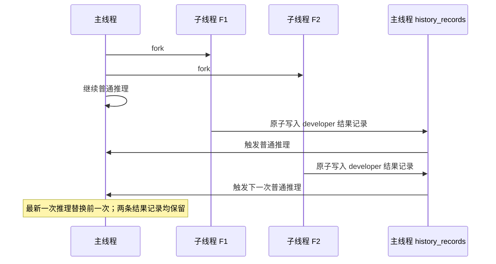

# 主线程与子线程语义

## 目标

Cybion 对外只有一个持续的主线程。子线程是由主线程委派、独立推进的后台工作；它们不是用户需要管理的会话。

本规范定义 fork、子线程终态写回主线程，以及用户新输入时的行为。上下文窗口如何由
`history_records`、`idx_head` 和 `idx_tail` 编译，见 [context.md](./context.md)。

## 术语

- **主线程**：接收用户消息、调用主线程工具、产生面向用户回复的唯一线程。
- **子线程**：由主线程调用 `fork_subthread` 创建的持久后台 Goal。每个子线程独立运行，直到达成、受阻或被显式取消。
- **fork 点**（`fork_from_id`）：创建子线程的主线程协议记录 ID。子线程按 `context.md` 从该点及其之前的主线程历史重建继承上下文。
- **子线程结果记录**：子线程进入终态时追加到主线程的一条特殊协议 `history_records`。它的 `thread_id` 为 `NULL`，payload 是 developer 消息，至少包含子线程 ID 与结果。该记录的 ID 写入子线程的 `outcome_record_id`，并参与后续主线程上下文编译。
- **普通主线程推理**：与处理用户消息相同的主线程 Responses 推理。它使用当时主线程最后一条协议记录作为 `idx_tail`，并依照 `context.md` 编译上下文。

`activity` 不是协议记录，不能作为子线程结果记录，也不能进入模型上下文。

## Fork

主线程调用 `fork_subthread` 时，系统必须持久化子线程的目标、完成条件、模型和 `fork_from_id`，然后将子线程置为可执行状态。

Fork 不会暂停、阻塞或等待主线程。工具调用返回后，主线程继续当前的普通推理；它可以继续调用工具，也可以在子线程完成之前回复用户。系统不设 join barrier，也不以“所有子线程完成”为主线程继续执行的前提。

子线程创建后独立运行。后续主线程历史的变化不会改变该子线程继承的 fork 边界；子线程每次推理均按自己的 `idx_tail` 和 `context.md` 重新编译上下文。

## 子线程终态与逐个 Join

子线程只有进入终态才会 join 主线程。终态包括达成（`achieved`）和受阻（`blocked`）；被取消的子线程不产生 join。

`achieve_goal` 和 `block_goal` 都必须携带非空的 `result`。该结果是子线程交给主线程的最终说明；达成还必须携带 `evidence`，受阻还必须携带 `reason`。调用终态工具后，子线程不得再请求模型生成补充文本。

每个子线程终态都必须独立执行下列顺序：

1. 在同一 SQLite 事务中，将一条子线程结果记录追加到主线程历史，并将该记录 ID 写入 `outcome_record_id`，同时把子线程标记为 `completed`。
2. 提交事务后，立即触发一次普通主线程推理。该推理的 `idx_tail` 必须不早于子线程结果记录。

事务保证子线程结果记录与 `completed` 状态同时可见。调度器必须持续补偿任何终态但尚未写入 `outcome_record_id` 的子线程；因此进程崩溃或重启不能遗失 join。

子线程结果记录的 developer 消息采用下列语义结构：

```text
### Subthread result

subthread_id: <child-id>
status: <achieved|blocked>

result:
<terminal handoff>
```

Join 不聚合、不批处理，也不等待其他子线程。若 F1、F2 分别完成，则两者分别追加结果记录，并分别触发一次主线程普通推理。

主线程采用 latest-response 语义：同一时刻只保留最新一次主线程推理。因而 F2 的 join 可以取消尚在执行的、由 F1 的 join 触发的主线程推理。这不会丢失 F1 结果：F1 的结果记录已经不可变地写入主线程历史；F2 触发的下一次推理会从最新主线程历史重新编译上下文。



## 用户新消息与子线程独立性

用户发送新的主线程消息时：

- 新消息会进入主线程历史，并触发主线程的普通推理。
- 已存在的子线程不暂停、不取消、不重置，也不改变其 fork 边界。
- 新消息本身不隐含“这项后台工作已无关”或“应当停止”的含义。

子线程的管理只能来自主线程的显式工具调用，例如查询、取消或重试子线程。主线程可以根据新的用户意图决定是否调用这些工具；在未调用前，子线程保持独立运行，并在自身终态时按本规范逐个 join。

## 不变量

1. fork 永远非阻塞；系统不存在隐式或全局的 join barrier。
2. 每个 `achieved` 或 `blocked` 子线程恰好产生一条持久的子线程结果记录，并且该记录先于相应的主线程 join 推理落库。
3. 每条子线程结果记录均是可编译的主线程 developer 协议消息；不得写成 `activity`。
4. 子线程完成事件逐个处理，不以其他子线程的状态为条件。
5. 用户新消息不会隐式改变任何子线程的生命周期；改变必须由主线程显式调用工具。
6. 主线程推理被更新请求取消时，已经持久化的主线程协议记录和子线程结果记录不得回滚或删除。

## Terminal handoff checkpoints

When a Goal reaches `achieved`, `blocked`, or `cancelled`, Cybion first persists the child thread's terminal assistant result. The controller then compacts the child’s applicable compiled context using the same recursive checkpointing algorithm used for overflow recovery. This can reduce arbitrarily long child histories, including oversized records, without making a child summary a main-thread checkpoint.

A successful terminal compaction writes its checkpoint only to the child thread. Cybion then appends a distinct, paired internal `subthread_handoff` function-call/output evidence record to the main history. Its output contains the terminal state, exact child checkpoint Markdown, checkpoint ID, source range, compaction-output provenance, and history retrieval route. The original `fork_subthread` call keeps its own one-to-one output pair.

If compaction fails, Cybion still appends the terminal handoff evidence with `handoff_checkpoint_status: unavailable` and deterministic child-thread retrieval metadata. The parent can continue; raw child history remains immutable and queryable. Only a later main-thread compaction may fold this join evidence into a true main checkpoint.
