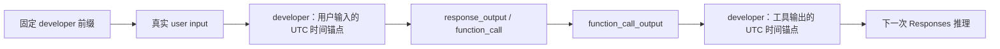

# Time Awareness（时间感知）

## 结论

Cybion 不把每次请求的动态“当前时间”放入固定 developer 前缀，也不要求 Agent 在需要时主动查询系统时间。它从不可变的 SQLite `history_records.created_at` 读取事件发生时间，并在编译普通推理上下文时，为真实用户输入和函数工具输出追加稳定的 UTC developer 时间锚点。

时间锚点让 Agent 能在跨日期、长时间运行或多轮工具调用中判断事件的真实先后关系，同时保持同一段历史重编译后的输入稳定，从而维持上游提示词缓存的亲和性。

## 定义

### 事件时间

**事件时间**是某条不可变 `history_records` 记录写入 SQLite 时保存的 `created_at`，采用 RFC 3339 UTC 表示。例如：

```text
2026-08-20T01:32:26Z
```

它与该记录的全局递增 `id` 一起构成可追溯的时间锚点：

```text
history record #183
persisted at UTC timestamp 2026-08-20T01:32:26Z
```

事件时间不是本次请求发送时的系统当前时间，也不是模型自行推断的时间。

### 时间锚点

**时间锚点**是编译上下文时生成、但不写回数据库的 developer 协议项。它紧随对应的真实协议记录，说明前一项的 record ID 与事件时间。

Cybion 目前为以下记录追加时间锚点：

- `role = user` 的真实 `input`；
- `type = function_call_output` 的 `tool_output`。

例如，真实用户输入后会出现：

```json
{
  "role": "developer",
  "content": "Trusted Cybion timeline metadata: the preceding user input is history record #182, persisted at UTC timestamp 2026-08-20T01:32:15Z."
}
```

函数工具输出后会出现：

```json
{
  "role": "developer",
  "content": "Trusted Cybion timeline metadata: the preceding tool output is history record #183, persisted at UTC timestamp 2026-08-20T01:32:26Z."
}
```

这些项只存在于本次编译出的 Responses `input[]`；它们不是新的 `history_records`，也不会改变原始协议 payload。

## 设计动机

长期任务可能跨越日期边界。例如，用户于 **2026 年 8 月 19 日** 发起任务，Agent 在工具执行、CI、发布或部署之后于 **2026 年 8 月 20 日** 获得新的工具输出。

没有事件时间时，模型可能把较晚的真实日期误认为“未来日期”，继而错误怀疑系统时钟、Release 时间或外部服务状态，并停止本应继续的操作。

时间锚点把日期绑定到具体的用户输入和工具结果，使模型可以直接理解：

```text
用户在何时提出请求；
工具在何时产生结果；
失败、恢复、验证和发布如何按时间发生。
```

## 方案取舍

### 不在固定 developer 前缀写动态当前时间

每轮请求写入动态当前时间会让稳定前缀持续变化：

```text
同一历史 + 不同请求时间
→ 不同 prompt 前缀
→ 降低上游缓存复用机会
```

它还只说明请求发生的时间，不能说明历史中每个事件发生的时间。

### 不依赖 Agent 按需查询时间

Agent 可以通过工具或 Bash 查询系统时间，但这种方式有三个限制：

1. 模型必须先意识到需要查询；
2. 查询增加工具调用、延迟和故障路径；
3. 查询结果是查询当时的时间，不能可靠标记较早的用户输入或工具输出。

时间感知是上下文理解的基础信息，不应依赖模型临时决定是否获取。

### 使用持久事件时间生成稳定锚点

`history_records.created_at` 与 `id` 已经是不可变、可重放、可审计的事实。根据它们生成时间锚点具有以下性质：

```text
同一 history record
→ 相同 record ID
→ 相同 created_at
→ 相同 developer 时间锚点
→ 相同历史再次编译时保持稳定
```

首次引入该机制会改变已有对话的编译前缀一次；之后相同历史的时间锚点保持不变。相较于工具输出和用户正文，锚点文本占用很小，但能避免跨日期推理错误。

## 普通上下文中的顺序

常规上下文先包含固定 developer 前缀，再按历史记录顺序编译协议项。时间锚点紧随其标记的事件：



一个简化后的上下文片段如下：

```text
[固定 developer 前缀]
[user input]
[developer: preceding user input → record #182, 2026-08-20T01:32:15Z UTC]
[function_call]
[function_call_output]
[developer: preceding tool output → record #183, 2026-08-20T01:32:26Z UTC]
```

时间锚点不复述用户正文或工具输出内容。它只说明紧邻前一项的可信记录身份与事件时间。

## 协议边界

`function_call_output` 是要向上游 Responses API 重放的协议对象，必须保持标准形状：

```json
{
  "type": "function_call_output",
  "call_id": "call_example",
  "output": "..."
}
```

Cybion 不向其中添加：

```text
history_record_id
created_at
timestamp
```

时间信息通过紧邻的 developer 时间锚点提供。这样，时间感知可进入普通推理，同时不改变函数调用与工具输出的标准配对语义，也不把非协议字段写入持久化历史。

## 主线程、子线程、重试与 checkpoint

### 主线程与子线程

主线程和每个持久子线程都有独立的 `history_records.thread_id` 边界。上下文编译器仅为实际进入该线程上下文的记录生成时间锚点：

- 主线程不会看到兄弟子线程的记录与锚点；
- 子线程继承主线程 fork 点之前的可见上下文，并追加自己的记录与锚点；
- 子线程自身 checkpoint 出现后，以该 checkpoint 为其后续上下文起点。

### 重试

纯传输重试没有新 protocol record，因此重新编译的历史、record ID、UTC 事件时间和时间锚点保持相同。重试不会制造新的“当前时间”文本。

### Checkpoint

checkpoint compaction 使用与普通推理相同的已编译协议历史，因此也能读取时间锚点。checkpoint 本身作为不可变 `history_records.kind = checkpoint` 保存；下一轮普通推理从 checkpoint 及其后的原始记录继续编译。

关于 checkpoint 窗口、递归压缩和 Chronicle 的详细规则，参见[上下文压缩规范](./context_compacting.md)。

## Chronicle timeline

Checkpoint 中的 `## Chronicle timeline` 是长期工作记忆中的因果时间线。它应尽可能保留仍会影响以下内容的事件：

- 概念与术语；
- 权威资源和位置；
- 决策与约束；
- 未完成工作；
- 失败、恢复、验证与发布之间的因果关系。

Chronicle 不采用固定条数上限。只有以下情况可以缩略合并：

- 对同一事实没有新增因果意义的重复报告；
- 被更高层结论完整覆盖的事实；
- 大量重复的事实覆盖信息。

合并后仍必须保留事件顺序，以及所有适用的 history record 引用。不同的决定、发现、故障、恢复、验证、发布或约束不能因为时间线过长而省略。

当记录具有精确 `created_at` 时，Chronicle 应使用该 UTC 时间；仅在没有可信事件时间时，才使用明确标记为推断的 record-order 锚点：

```markdown
- [after record #18, before record #27 | inferred] Context recovery started. (record #21)
```

## 可信边界

时间锚点只证明 Cybion 将一条 history record 持久化到 SQLite 的时间。它不自动证明：

- 用户在现实世界中撰写文本的时间；
- 外部系统事件实际发生的时间；
- 网络传输、CI 或第三方服务的精确发生时间。

当工具输出包含第三方时间戳时，Agent 应把它视为独立的外部证据，并区分其来源与 Cybion 的持久化事件时间。

## 维护要求

修改上下文编译器时必须保持以下约束：

1. 时间锚点必须只从持久化的 `history_records.id` 与 `history_records.created_at` 派生。
2. 时间锚点必须字节稳定；不得注入每次请求的动态当前时间。
3. 时间锚点不得写回 `history_records`。
4. `function_call_output` 必须保持标准 Responses 协议字段。
5. 主线程、子线程、重试与 checkpoint 必须使用同一套编译顺序规则。
6. Chronicle 必须保留长期因果价值，而不是按固定条数截断。
